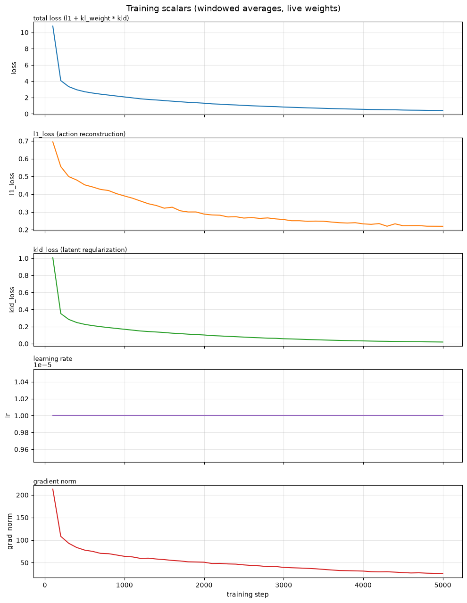
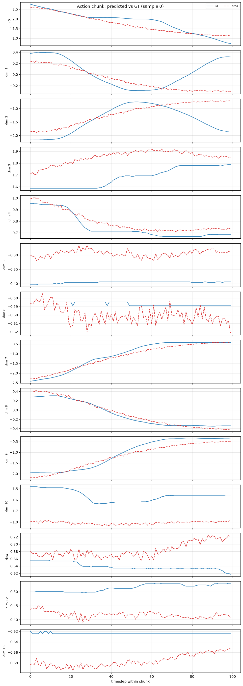
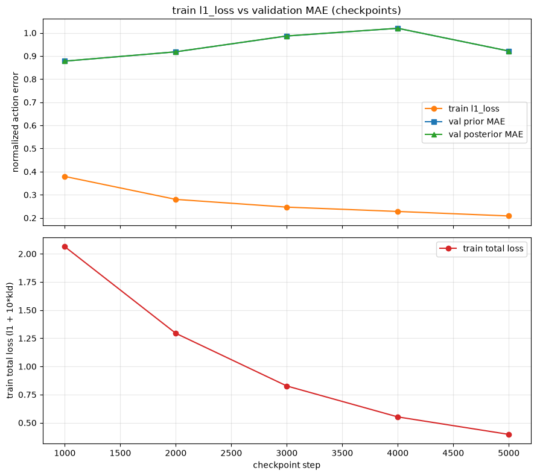
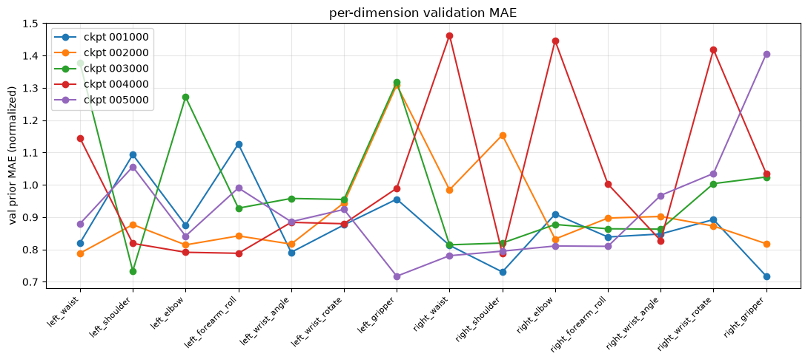
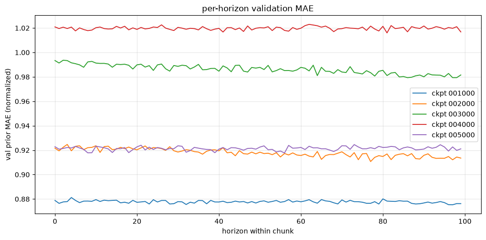
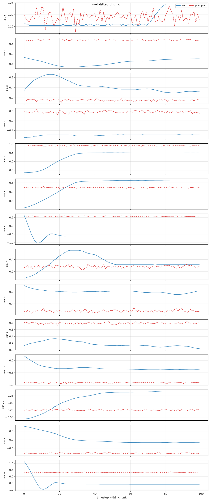
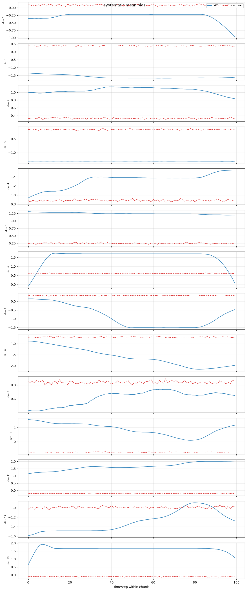
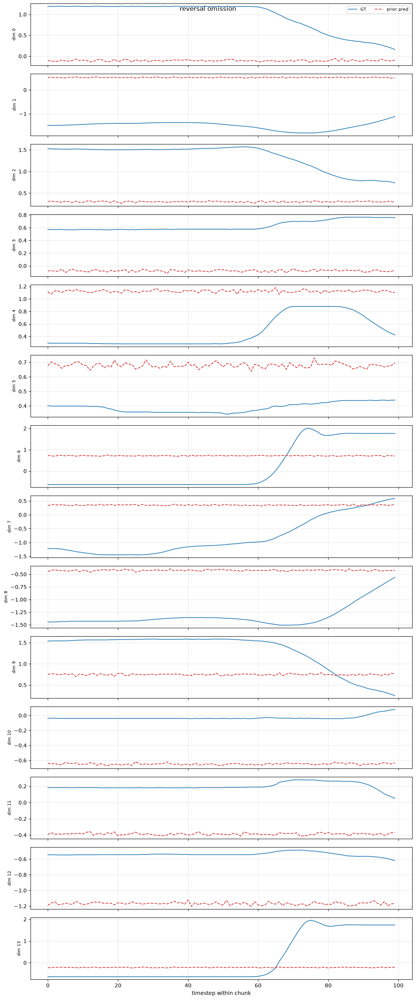
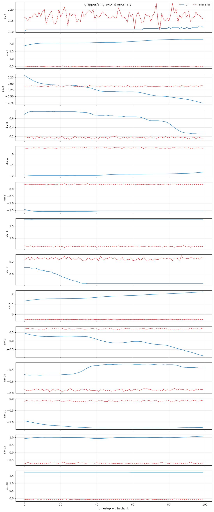
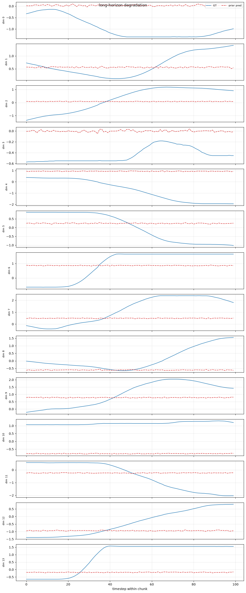

# ACT 复现实验记录（LeRobot + ALOHA）

> **核心实验**：ACT + `lerobot/aloha_mobile_cabinet` 5k offline baseline
> **日期**：2026-08-30
> **状态**：已闭环。full-data 5k、独立 68/17 episode-split 5k、checkpoint 对比与局限分析均已完成
> **固定边界**：无机器人实机；mobile-cabinet 无匹配仿真闭环，不虚构成功率

---

## 1. 实验概述与证据边界

### 1.1 Smoke test

20-step smoke run 只用于验证工程链路，不进入性能评价：

> ACT + ALOHA 数据、forward/loss、backward 和 optimizer 的 smoke 链路能够运行。

它不参与性能曲线、不比较 checkpoint、不补资源与动作指标。正式实验只围绕 5k baseline 展开。

### 1.2 三类证据

| 证据 | 对应实验 | 能证明什么 | 不能证明什么 |
|---|---|---|---|
| 训练稳定性 | ALOHA mobile-cabinet full-data 5k | 真实机器人离线数据上的训练链路、优化稳定性 | 未见 episode 泛化、真实任务成功率 |
| 离线策略泛化 | 已完成的 68/17 episode-split 5k run | prior action prediction 在未见 episode 上的 checkpoint 趋势 | 闭环误差累积、实机成功率 |
| 闭环工程链路 | 已完成的 ACT + PushT rollout | checkpoint load → action → env → metrics/video | ALOHA cabinet 的真实成功率 |

> 三类证据必须分栏展示，不能把 PushT 成功率或仿真结果写成 mobile-cabinet 性能。

---

## 2. 数据集（Dataset Card）

数据来源：[官方 `meta/info.json`](https://huggingface.co/datasets/lerobot/aloha_mobile_cabinet/blob/main/meta/info.json)

| 字段 | 数值 |
|---|---|
| repo | `lerobot/aloha_mobile_cabinet` |
| dataset revision | 未随当前导出提供，作为非阻塞元数据缺项记录 |
| codebase version | v3.0 |
| robot type | ALOHA |
| episodes | 85 |
| frames | 127,500 |
| tasks | 1 |
| fps | 50 |
| 平均 episode | 1,500 frames，约 30 秒（按总量计算） |
| cameras | `cam_high`、`cam_left_wrist`、`cam_right_wrist` |
| image shape | 480×640×3 |
| state/action | float32，14 维 |
| published split | `train: 0:85`，没有 validation split |

### 14 维 state/action 顺序

```text
0  left_waist
1  left_shoulder
2  left_elbow
3  left_forearm_roll
4  left_wrist_angle
5  left_wrist_rotate
6  left_gripper
7  right_waist
8  right_shoulder
9  right_elbow
10 right_forearm_roll
11 right_wrist_angle
12 right_wrist_rotate
13 right_gripper
```

---

## 3. 实验 1：Full-data 5k baseline（训练链路验证）

### 3.1 已确认配置

```text
policy.type=act
policy.device=cuda
policy.push_to_hub=false
dataset.repo_id=lerobot/aloha_mobile_cabinet
output_dir=outputs/train/act_aloha_cabinet_5k
steps=5000
batch_size=8
env_eval_freq=0
save_freq=1000
log_freq=100
viz_freq=500
```

| 字段 | 记录 |
|---|---|
| status | completed |
| episodes used | 未指定 subset，使用 published train split 的 85 episodes |
| checkpoint cadence | 每 1,000 step；核对 1000/2000/3000/4000/5000 |
| environment eval | `env_eval_freq=0`，明确关闭 |
| action-chunk visualization | train sample、prior `z=0`、normalized、padding excluded |
| device / batch | CUDA / 8 |
| output | `outputs/train/act_aloha_cabinet_5k` |

> 上述配置来自 VS Code `launch.json`，非完整 resolved `train_config.json`。以下字段需从 checkpoint 内保存的配置固化：LeRobot commit/version、dataset revision、seed/precision/num workers、optimizer/weight decay/gradient clipping/scheduler、`chunk_size`/`n_action_steps`/KL weight/normalization、total/trainable parameters、checkpoint 是否含 optimizer/training state。
>
> 官方 ACT 默认通常为 `chunk_size=100`、`n_action_steps=100`、`kl_weight=10`、mean/std normalization、AdamW `lr=1e-5`，只能用于核对，本地 resolved config 才是最终证据。[官方 ACT 配置](https://github.com/huggingface/lerobot/blob/main/src/lerobot/policies/act/configuration_act.py)

### 3.2 训练标量观察



| 指标 | 图像目测 | 判断 |
|---|---:|---|
| total loss | 约 10+ → 0.35–0.4 | 稳定下降，无明显发散 |
| L1 loss | 约 0.70 → 0.22 | 训练动作重建明显改善 |
| KLD loss | 约 1.0 → 0.02 | posterior 与 prior 正则项变小；不能单凭此图断言 posterior collapse |
| learning rate | 约 `1e-5` 恒定 | 看起来没有 scheduler，待 config 复核 |
| gradient norm | 约 210 → 25 | 窗口均值下降，无持续梯度爆炸迹象 |

> 以上为窗口曲线目测值。最终报告需原始 CSV：`step,total_loss,l1_loss,kld_loss,grad_norm,lr,step_s,samples_s,mem_gb`

### 3.3 Train sample 的 prior action chunk



已确认：train sample、prior inference `z=0`、normalized action、padding 已排除、chunk length 100（50 fps 下覆盖约 2 秒）、14 维对应左右臂各 6 个关节和 1 个 gripper。

定性观察：

- `dim 0/4/7/8/9` 的主要趋势较接近，但仍有幅值或尾部误差；
- `dim 1/2` 只跟住部分趋势，没有完整捕捉后半段反转；
- `dim 3/5/6/10/11/12/13` 存在不同程度的系统偏置或变化幅度不足；
- 使用 `z=0` 使该图比 posterior reconstruction 更接近 ACT 的真实推理 latent 路径；
- 样本来自 train，只能作为训练分布内 prior fitting 证据，不能证明泛化。

> 仍需为该图记录：checkpoint step/path、episode/frame、`model.eval()`、推理 API、seed，以及 overall/per-dim/per-horizon 误差。

---

## 4. 实验 2：Episode-split 5k（未见 episode 泛化验证）

### 4.1 为什么需要独立 split

数据集只有官方 `train: 0:85`。5k 启动配置没有指定 `dataset.episodes`，因此 full-data run 的模型见过全部 85 个 episode。若再从这 85 个 episode 中抽出 17 个称 validation，会产生训练泄漏，只能算训练分布诊断，不能作为未见 episode 泛化证据。

因此完成了一次固定 episode split 的 5k run；它与 full-data run 的用途不同，**两者训练结果不混入同一条性能曲线**。

### 4.2 Split 与训练配置

| 字段 | 实际结果 |
|---|---|
| split | 68 train / 17 validation |
| split seed | 42 |
| split unit | episode，禁止随机拆 frame |
| 完整性 | train/validation 交集为空；并集完整覆盖 0–84 |
| split artifact | `outputs/act_aloha_68ep/split.json` |
| train frames | 102,000 |
| train seed | 1000 |
| steps / batch | 5,000 / 8 |
| checkpoints | 1000/2000/3000/4000/5000 |
| precision / workers | FP32 / 4 workers |
| model | ACT，52M trainable parameters |
| chunk / action steps | 100 / 100 |
| optimizer | AdamW，LR `1e-5`，weight decay `1e-4`，grad clip 10 |
| normalization | image/state/action 均为 mean/std |
| VAE | enabled，latent dim 32，KL weight 10 |
| scheduler / EMA | none / disabled |
| environment eval | disabled |
| wall time | 约 11 分 19 秒 |
| peak logged VRAM | 约 5.77 GB |
| final throughput | 约 54 samples/s |
| dataset-equivalent epoch | 约 0.39 |

> 训练日志确认 `dataset.num_episodes=68`，成功保存全部五个 checkpoint。完整 resolved config 与日志见 `outputs/act_aloha_68ep/train_68ep.log`。

### 4.3 Checkpoint 结果

每个 checkpoint 在 17 个 validation episodes 上采样 2,550 个 frame。主指标使用 prior action prediction；下表来自最终 `eval/summary.json`。

| checkpoint | train total | train L1 | train KLD | grad norm | val normalized MAE ↓ | val normalized RMSE ↓ | aggregate raw MAE ↓ |
|---:|---:|---:|---:|---:|---:|---:|---:|
| 1,000 | 1.675 | 0.317 | 0.136 | 57.629 | **0.8777** | **1.0922** | **0.3989** |
| 2,000 | 1.038 | 0.266 | 0.077 | 44.584 | 0.9180 | 1.1098 | 0.4197 |
| 3,000 | 0.699 | 0.242 | 0.046 | 36.427 | 0.9863 | 1.2095 | 0.4412 |
| 4,000 | 0.465 | 0.220 | 0.024 | 28.404 | 1.0198 | 1.2723 | 0.4570 |
| 5,000 | 0.397 | 0.208 | 0.019 | 25.399 | 0.9214 | 1.1750 | 0.4247 |

核心观察：

- train L1 从 0.317 持续下降到 0.208，但 validation MAE 没有同步下降；
- 1k 是本次固定评测协议下的最优 checkpoint；2k、3k、4k 相对 1k 分别恶化约 4.6%、12.4%、16.2%；
- 5k 相对 4k 有明显恢复，但仍比 1k 差约 5.0%；
- 训练仅覆盖约 0.39 个 dataset-equivalent epoch，因此将其称为 **checkpoint-level train/validation divergence**，不直接断言经典过拟合；可能因素包括 episode 分布差异、短训练下的优化波动、归一化口径或评测随机性；
- aggregate raw MAE 混合了不同关节和 gripper 的单位，只能用于同协议 checkpoint 排序，不能解释为统一的物理误差。



### 4.4 Per-dimension 与 per-horizon

**Per-dimension（validation MAE）**：

- 1k 的最低误差维度：`right_gripper` 0.717、`right_shoulder` 0.731、`left_wrist_angle` 0.791；
- 1k 的最高误差维度：`left_forearm_roll` 1.126、`left_shoulder` 1.094、`left_gripper` 0.956；
- 不同 checkpoint 的最差维度明显变化，单一 overall MAE 会掩盖关节级退化；checkpoint 选择应同时保留 per-dim 结果。



**Per-horizon（validation MAE）**：

- 各 checkpoint 的 100-step horizon 曲线几乎水平；1k 的前 10 与后 10 step 均值分别约 0.8783 和 0.8766；
- 当前结果没有显示"预测越远误差越大"的典型趋势；这可能是真实结果，也可能说明预测近似维度均值，或 horizon 聚合/采样口径需要审计；
- 因此不能仅凭当前曲线宣称 ACT 解决了长时域退化。



### 4.5 Action-chunk 失配案例（五类）

自动生成的五类 chunk 图用于展示典型失配形态；不把 `well_fitted` 等自动标签当作严格定量分类（见 §5.3）：











---

## 5. 已知限制与冻结口径

以下内容作为实验局限永久保留，不再追加审计任务：

1. `eval_smoketest` 与正式 `eval` 对同一 5k checkpoint 分别得到 MAE 0.9633 和 0.9214；最终结论统一采用覆盖 1k–5k 的正式 `eval/summary.json`，不混用 smoketest 数值。
2. prior/posterior MAE 在所有 checkpoint 上只相差约 `1e-5–3e-4`；无法仅凭现有产物判断 latent 是否发生 collapse 或 posterior 路径是否被完整评测，因此 posterior 不进入核心结论。
3. 自动生成的五类 chunk 图用于展示典型失配形态，不把文件名 `well_fitted` 等自动标签当作严格定量分类。
4. aggregate raw MAE 混合不同关节和 gripper 的量纲，只用于相同协议下的 checkpoint 排序。
5. mobile-cabinet 没有匹配仿真和实机评测，实验结论止于离线 action prediction，不能外推为真实任务成功率。
6. LeRobot commit、dataset snapshot revision、checkpoint 文件大小和实际费用未随当前导出目录提供，记为复现元数据缺项，不阻塞本阶段闭环。

> **冻结决策**：以正式评测的 1k checkpoint 作为最佳离线 checkpoint；不再增加训练步数、seed、数据集或评测轮次。

---

## 6. 复现边界声明

- 不给 20-step smoke run 补详细数据；
- 不要求 mobile-cabinet 仿真或实机成功率；
- 不把 checkpoint 放进不匹配的 AlohaTransferCube 环境；
- 不重跑 3 个训练 seed；
- 不做 ACT 超参数消融；
- 不自动延长到 10k；
- 不同时长训另一个 ACT 数据集。

---

## 7. 闭环清单

以下 6 项构成此次 ACT 复现闭环，全部完成：

- [x] **Episode-split run**：固定 68/17 episode ID、split seed、5k 训练和五个 checkpoint 已完成。
- [x] **训练与资源归档**：resolved config、完整日志、wall time、peak logged VRAM、throughput 和参数量已归档；未提供字段已记录为非阻塞元数据缺项。
- [x] **Validation 主结果**：1k–5k 的 prior overall/per-dim/per-horizon normalized 指标、aggregate raw MAE 和曲线已生成；正式协议下选择 1k。
- [x] **异常与失败分析**：记录 train/validation divergence、per-dim 差异、平坦 horizon 曲线和 action-chunk 失配模式。
- [x] **局限说明**：固定两次 5k 评测差异、posterior 不确定性、自动案例标签与元数据缺项，不再追加审计。
- [x] **证据边界**：ALOHA mobile-cabinet 负责离线 action 泛化；既有 PushT rollout 负责闭环工程链路；明确无实机成功率。

---

## 8. 实验产物

```text
code/reproduction_act_aloha.md      ← 本文档
code/outputs/act_aloha_5k/          ← full-data 5k run 产物
├── training_scalars_5k.png         （训练标量曲线）
└── action_chunk_sample0.png        （prior action chunk 样本）
code/outputs/act_aloha_68ep/        ← episode-split run 产物
├── split.json                      （68/17 episode 划分）
├── train_68ep.log                  （训练日志）
├── eval.log
├── offline_eval_results.csv
├── eval/                           ← 正式评测（核心结论依据）
│   ├── summary.json
│   ├── train_vs_val_curves.png
│   ├── per_dim_error.png
│   ├── per_horizon_error.png
│   └── chunks/                     （五类 action-chunk 失配案例图）
└── eval_smoketest/                 ← smoke 评测（不进入核心结论）
```
