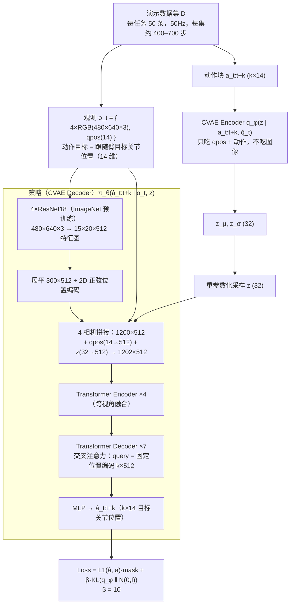
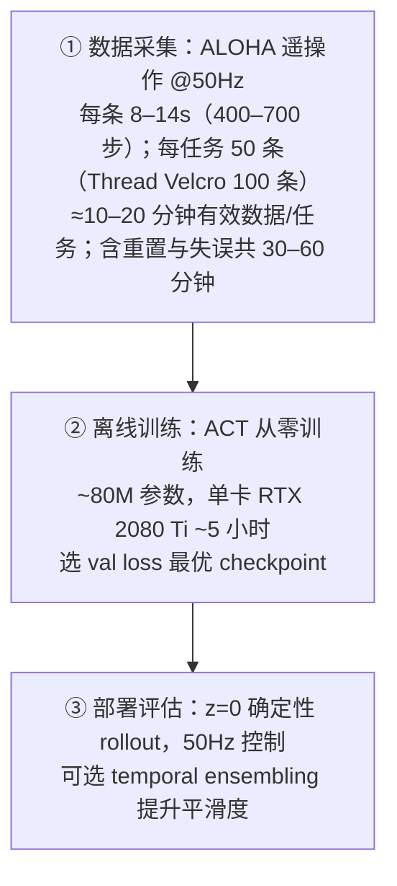

# Learning Fine-Grained Bimanual Manipulation with Low-Cost Hardware

> **一句话总结：** 这篇论文同时交付了两样东西——低成本双臂遥操作平台 **ALOHA**（2 台 ~$5.6k 的 ViperX 机械臂 + 3D 打印件，总价 <$20k）和模仿学习算法 **ACT**（Action Chunking with Transformers）。ACT 把"单步预测"改为"一次预测 k=100 步动作序列"（**动作分块**，把任务有效水平线缩短 k 倍），并用 **CVAE**（隐变量 z 编码"动作风格"）建模人类演示的多模态性，配合**时间集成**（Temporal Ensembling）在线平滑。最终让精度只有 5–8mm 的低成本硬件，仅用 ~10 分钟（50 条）演示就学会了 6 个真实世界精细双臂任务（开酱料杯、插电池等），成功率 80–90%，在各任务上大幅超越 BC-ConvMLP / BeT / RT-1 / VINN 等基线。

> **⚙️ 配套复现：** 本论文的 LeRobot 复现实验（ALOHA mobile-cabinet 5k 训练/评测闭环）见 [code/reproduction_act_aloha.md](../../code/reproduction_act_aloha.md)，下方标注 🔁 处与复现文档对照。

## 1. Paper Information

- **标题**: Learning Fine-Grained Bimanual Manipulation with Low-Cost Hardware（ACT: Action Chunking with Transformers）
- **作者**: Tony Z. Zhao (Stanford), Vikash Kumar (Meta), Sergey Levine (UC Berkeley), Chelsea Finn (Stanford)
- **发表**: Robotics: Science and Systems (RSS) 2023
- **链接**: [arXiv](https://arxiv.org/abs/2304.13705) | [官方代码](https://github.com/tonyzhaozh/act) | [Project Page](https://tonyzhaozh.github.io/aloha/)

---

## 2. Motivation

### 2.1 Background

- **精细操作是机器人学难点**：穿扎带、插 288 针内存条、撬开酱料杯盖这类任务需要毫米级精度、对接触力的精细协调和闭环视觉反馈。现有系统依赖昂贵硬件（达芬奇手术机器人、ABB YuMi；遥操作方案 DexPilot ~$100k、Shadow 系统 ~$400k），且需要精密标定。
- **行为克隆（BC）的复合误差**：策略单步预测的小误差会随时间累积，把机器人逐渐推出训练数据分布，进入难以恢复的状态（Ross et al. 2010）。在精细操作中这一现象尤其致命（Ke et al. 2021）。
- **人类演示是多模态、非平稳的**：同一观测下人类可能用不同轨迹完成任务；人类在精度要求低的区域动作更随机（Li 2006）；演示中还含有**与时间相关的混淆因素**（如中途停顿），单步马尔可夫策略难以建模，而带历史条件又会引入因果混淆（de Haan et al. 2019）。
- **已有缓解手段都有硬伤**：DAgger 一类需要在线专家干预（遥操作界面下重复纠错不自然）；采集时注入噪声（DART）在精细任务上会直接导致任务失败；离线的合成校正数据（如 grasp 特征、低维状态）局限于特定场景，无法用于高维视觉观测。
- **环境建模路线不划算**：精细操作往往涉及复杂物理（接触、塑料形变），预测"物体将如何运动"需要大量任务特化工程；而**学习"面对不同状态该怎么做"的策略要简单得多**——闭环策略能实时反应、补偿误差。

### 2.2 Goal

> **让低成本、不精确的硬件，仅靠学习（端到端模仿学习）完成高精度的精细双臂操作。**

具体拆成两个子问题：
1. **硬件/数据侧**：如何低成本地采集高质量演示？→ 构建 ALOHA 遥操作平台。
2. **算法侧**：如何从嘈杂、多模态的演示中学出精准、闭环的行为？→ 提出 ACT 算法。

### 2.3 核心洞察

- **像素到动作（pixel-to-action）+ 闭环补偿**：与其精确建模环境物理，不如学习一个能"看-反应"的闭环策略；毫米级误差不必预先避免，只需被视觉反馈实时纠正。这是低成本硬件也能做精细操作的根本信心来源。
- **动作分块 = 降低有效水平线**：借鉴心理学"动作组块"概念（Lai et al. 2022），把 k 个动作合成一个单元执行。误差传播只发生在块与块之间，有效任务水平线缩短 k 倍——**在不引入在线干预的前提下从根本上压缩复合误差**。同时天然建模块内的非马尔可夫行为（停顿）。
- **人类数据要用生成模型来学**：多模态 + 随机的人类演示下，均方误差式的 BC 会收敛到"平均动作"（模态平均）。把策略训练成 CVAE，用隐变量 z 显式选择"要执行哪个模式"，才能学到精准的单模态行为。

---

## 3. Core Ideas

### ① Action Chunking：一次预测 k 步，而不是 1 步

策略建模 π_θ(a_{t:t+k} | s_t) 而非单步：每 k 步观察一次、生成并执行 k 步动作，任务有效水平线缩短 k 倍，把"高频闭环控制问题"转化为"序列预测问题"。消融 k=1 仅 1%、k=100 达 44%——**全文最核心的贡献**。

### ② CVAE 训练：用"风格变量" z 建模多模态演示

编码器把 (当前关节 + 未来动作块) 压缩成 32 维隐变量 z（动作风格），解码器即策略本体，在 (o_t, z) 条件下生成动作块；推理时丢弃编码器、z=0 确定性解码（细节见 §5.1）。消融：脚本数据可有可无（59 vs 58），**人类数据是生死线（35.3 vs 2）**。

### ③ Temporal Ensembling：每步查询 + 指数加权平均

每个时间步都查询策略，使动作块互相重叠，再对"预测同一时刻的多份动作"做指数加权平均（w_i = exp(−m·i)）。与相邻时刻平滑不同，这**无偏**（不加滞后）、零训练成本（细节见 §5.3）。消融 ACT +3.3%、BC-ConvMLP +4%；对 VINN 反而有害（−20%）。

### ④ ALOHA：关节空间映射的低成本双臂遥操作

背驱小臂 WidowX 250（$3.3k）领导 → 同构大臂 ViperX 300（$5.6k）跟随的**关节空间直接映射**（避开 IK 奇异点、带宽高延迟低）；总价 <$20k、2 小时可组装（细节见 §5.4）。它把"高质量精细演示"的采集门槛降到普通实验室负担得起。

---

## 4. Overall Framework

### 数据流（训练阶段，CVAE Encoder 参与）



> **推理阶段**：丢弃 Encoder，z=0 确定性解码：`o_t → ResNet18×4 → TF-Enc×4 → TF-Dec×7 → â_t:t+k`；每步查询（可选时间集成）后，由低层高频 PID（Dynamixel 内）跟踪目标关节位置。详见 §8。

### 训练与采集流程（纯离线 IL，无在线交替）



---

## 5. Key Modules

### 5.1 CVAE Encoder

#### Motivation

人类演示多模态（同一观测下轨迹不同、精度不敏感区域更随机）。若策略是确定性映射，均方误差会把模式**平均**成"四不像"轨迹——需要显式建模"这次按哪种风格做"。

#### 核心思想

BERT 风格 TransformerEncoder：
- **输入序列**（长度 k+2）：可学习 `[CLS]` token + 线性投影后的当前关节 qpos(14→512) + 目标动作块 a_t:t+k（k×14→k×512），加固定正弦位置编码。
- **输出**：取 `[CLS]` 对应特征，经线性层映射为对角高斯的 (μ, σ²)（32 维）。
- **训练**：重参数化采样 z = μ + σ·ε，ε~N(0,I)。
- **关键决策**：编码器**只吃 qpos 和动作、不吃图像**——训练更快，且足够编码行为模式。

> **一句话总结：** 把"未来动作 + 当前关节"压缩成 32 维风格变量 z，让多模态演示在隐空间被显式区分——这是 CVAE 能战胜确定性 BC 的根源。推理时整个模块被丢弃，训练成本为零。

### 5.2 策略（CVAE Decoder）

#### Motivation

需要一个在高维视觉 + 多模态意图（z）条件下生成连贯动作序列的生成器：encoder 综合多源信息（多视角图像、关节、风格），decoder 做序列连贯生成。

#### 核心思想

- **视觉 backbone**：4 路 ResNet18（ImageNet 预训练，BatchNorm 冻结为 FrozenBatchNorm2d），480×640×3 → 15×20×512 特征图 → 展平 + **2D 正弦位置编码** → 300×512/相机；官方代码中 4 相机共享同一 backbone（`# HARDCODED`）。
- **特征拼接**：4 相机 1200×512 + qpos(14→512) + z(32→512) = **1202×512** → TransformerEncoder×4（跨视角融合）。
- **序列生成**：TransformerDecoder×7（8 头，FFN 3200，post-norm）交叉注意力：**query = 固定位置编码（k×512，DETR 风格）**，key/value 来自 encoder 输出 → k×512 → MLP → **k×14** 目标关节位置。
- **动作表示**：预测**绝对目标关节位置**（14 维：双臂 7+7），由低层 PID 跟踪。论文明确验证：增量关节位置（delta）效果变差。
- **重建损失用 L1 而非 L2**：正文说明 L1 对动作序列建模更精确（Algorithm 1 误写 MSE，见 §7 核对表）。

> **一句话总结：** 一个"图像融合 Transformer encoder + 动作生成 Transformer decoder"的条件生成器——把 z 作为额外 token 注入 encoder，让解码出的动作块带上明确的风格选择。

### 5.3 Temporal Ensembler（推理时组件）

#### Motivation

naive 分块每 k 步才接收新观测，块内完全开环、切换瞬间动作生硬。如何保持高频闭环、又不引入平滑偏置？

#### 核心思想

论文 Algorithm 2：
- **每时间步**都查询策略（块长 k，步进 1），得到互相重叠的动作块。
- 维护 FIFO 缓冲；对**预测同一时刻 t** 的多份动作做指数加权平均：`a_t = Σ_i w_i·B_t[i] / Σ_i w_i`，`w_i = exp(−m·i)`（w_0 最旧）。
- **m 控制新观测融入速度**：m 大 → 新信息融入慢（更平滑迟钝）；m 小 → 反应快。官方参考值 m=0.01。
- 与"相邻时刻动作加权"的常规平滑不同，聚合的是**同一时刻的不同来源预测**——无偏、不引入滞后；实现上可在线递推，零训练开销。

> **一句话总结：** 用"重复预测 + 指数加权平均"把分块策略变成逐帧闭环——平滑且无偏，是动作分块能实用化的关键配套（消融 +3.3%）。

> **🔁 对照复现**：本工程复现**未启用时间集成**（配置 chunk=100 / n_action_steps=100，即 queue 模式），离线主指标为 prior 动作预测——配置见 [复现文档 §4.2](../../code/reproduction_act_aloha.md)。

### 5.4 ALOHA 硬件平台（数据侧）

#### Motivation

高价遥操作系统（VR 手柄、动捕手套、$100k–$400k 机械臂/灵巧手）不普及；任务空间 IK 在 6 自由度臂奇异点附近频繁失效。需要普通人能上手、可复现的采集方案。

#### 核心思想

- **关节空间映射**：背驱小臂 WidowX（领导）→ 同步大臂 ViperX（跟随）。避开 IK、高带宽低延迟、领导端重量天然阻尼手抖。
- **3D 打印件**：透明手指（精细操作保持视野）+ grip tape（薄塑料膜也能抓牢）；"handle & scissor"把手（连续夹爪控制）；橡皮筋重力补偿（>30 分钟连续遥操作可行）。
- **传感**：4× Logitech C922x（480×640 RGB@30fps）——两腕（近距观察夹爪）、一正前方（旋转 90° 增垂直视野）、一顶视；遥操作与录制均 50Hz。
- **数据**：记录**领导端关节位置**作为动作（而非跟随端）——两者之差隐含力信息（经 PID）。
- **规格**：左右各 7 DoF（6+夹爪）、75cm 工作半径、可重复性 1mm、标称精度 5–8mm、750g 负载、$5.6k/台。

> **一句话总结：** <$20k、2 小时可组装、非专家可操作的双臂遥操作平台——把"高质量精细化演示"的门槛压低到普通实验室负担得起。

---

## 6. Mathematical Formulation

### 符号说明

| 符号 | 含义 | 维度 |
|------|------|------|
| $s_t$ / $o_t$ | t 时刻观测（4 图像 + 14 维关节位置） | 图像 4×480×640×3 + 14 |
| $\bar{o}_t$ | 去图像版的观测（仅关节位置） | 14 |
| $a_t$ | t 时刻动作（双臂目标关节位置） | 14 |
| $a_{t:t+k}$ | 动作块（chunk） | k×14 |
| $\hat{a}_{t:t+k}$ | 策略预测的动作块 | k×14 |
| $k$ | 块大小（chunk size） | —（取 100） |
| $z$ | 风格变量（隐变量，对角高斯） | 32 |
| $q_\phi(z\|a_{t:t+k},\bar{o}_t)$ | CVAE 编码器（后验） | — |
| $\pi_\theta(\cdot\|o_t,z)$ | CVAE 解码器 = 策略 | — |
| $\beta$ | KL 权重 | 10 |
| $m$ | 时间集成衰减系数 | 0.01（代码） |
| $L_1$ | 重建损失项 | — |
| $L_{reg}$ | 正则（KL）项 | — |

### CVAE 目标：最大化演示块的似然

模仿学习目标是最大化演示数据的条件对数似然（等价于 VAE 的 ELBO 形式——CVAE 标准框架，Sohn et al. 2015）：

$$\min_{\theta} \; \sum_{(s_t, a_{t:t+k}) \in \mathcal{D}} -\log \pi_\theta(a_{t:t+k} \mid s_t)$$

用 CVAE 的变分目标展开：

$$\log \pi_\theta(a_{t:t+k}|s_t) \;\geq\; \underbrace{\mathbb{E}_{z \sim q_\phi}\big[\log p_\theta(a_{t:t+k} \mid s_t, z)\big]}_{= -L_{\text{reconst}}} - \underbrace{D_{KL}\big( q_\phi(z \mid a_{t:t+k}, \bar{o}_t) \;\|\; p(z) \big)}_{= L_{\text{reg}}}$$

- **重建项**：解码器（策略）在 z 下重构动作块，实现对每个时间步动作的 **L1**（正文明确 L1 优于 L2；Algorithm 1 误写 MSE——见 §7 核对表）。
- **正则项**：把后验推向标准高斯先验 $p(z)=\mathcal{N}(0,I)$。$\beta$ 越大，z 携带信息越少（β-VAE 信息瓶颈，Higgins et al. 2017）。
- **训练/推理差异**：训练时 z 从后验采样（重参数化保证反传）；**推理时 z=0**（先验均值）确定性解码——便于评估与复现。

### KL 散度的闭式解（高斯对高斯）

两个对角高斯的 KL 有解析解；代码中采用 log-variance 参数化（$2\log\sigma$，与官方实现一致）：

$$D_{KL}\big(\mathcal{N}(\mu, \mathrm{diag}(\sigma^2)) \;\|\; \mathcal{N}(0, I)\big)
= \tfrac{1}{2}\sum_{d=1}^{32} \big(\sigma_d^2 + \mu_d^2 - 1 - 2\log\sigma_d\big)$$

代码形式（官方实现 `mean_kld`）：
$$\text{KL} = -\tfrac{1}{2}\sum_d \big(1 + \log\text{var}_d - \mu_d^2 - e^{\log\text{var}_d}\big)$$

### 训练目标 / Loss 汇总

$$\mathcal{L} = \underbrace{\Big(\frac{1}{|V|}\sum_{(t)\in V} \big|\hat{a}_t - a_t\big|\Big)}_{L_1,\, V=\text{非 padding 时间步}} + \beta \cdot \underbrace{D_{KL}\big(q_\phi \,\|\, \mathcal{N}(0,I)\big)}_{\text{批量均值}},\qquad \beta = 10$$

- chunk 尾部不足 k 步的 padding 用 `is_pad` 掩码排除在 L1 之外（只对真实动作求误差）。
- `is_pad` 头在代码中被计算但**不参与损失**。

> **🔁 14 维动作维度**：双臂各 6 关节 + 1 夹爪的具体顺序（`left_waist → right_gripper`）见 [复现文档 §2 的 state/action 顺序表](../../code/reproduction_act_aloha.md)。

---

## 7. Training Pipeline

```
─────────────────────────────────────────────────────────────
Algorithm 1: ACT Training（官方论文版，注：L1 为主文、MSE 为算法框误写）
─────────────────────────────────────────────────────────────
 1:  Given: 演示集 D, 块大小 k, 权重 β
 2:  a_t, o_t ← 观测/动作；ō_t ← o_t 去掉图像
 3:  初始化 CVAE 编码器 q_φ(z|a_t:t+k, ō_t)
 4:  初始化解码器 π_θ(â_t:t+k | o_t, z)
 5:  for iteration n = 1, 2, ... do
 6:      从 D 采样 (o_t, a_t:t+k)
 7:      从 q_φ 采样 z                                  # 重参数化
 8:      â_t:t+k ← π_θ(o_t, z)                          # 前向
 9:      L_reconst ← L1(â_t:t+k, a_t:t+k)               # 论文算法框误写为 MSE
10:      L_reg ← D_KL(q_φ(z|·) ‖ N(0, I))
11:      θ, φ ← ADAM, L = L_reconst + β·L_reg
─────────────────────────────────────────────────────────────
```

**训练数据组织**（官方实现）：每次随机采样一个起点 `start_ts`（episode 内均匀），取**单帧观测**（不拼接历史帧）+ 其后最多 k=100 步动作；qpos 与动作用数据集统计量标准化。80/20 按 episode 划分训练/验证。

**论文超参（Table III）与官方代码比对**：

| 超参 | 论文/官方 | 备注 |
|---|---|---|
| chunk size k | 100 | 消融最优（k=1 仅 1%） |
| latent dim | 32 | — |
| encoder layers | 4 | 图像特征融合的 TransformerEncoder；另 CVAE encoder 也 4 层 |
| decoder layers | **7（写明）→ 实际 1** | 官方代码 bug：只有第一层生效（issue #25） |
| #heads | 8 | — |
| hidden dim | 512 | — |
| feedforward | 3200 | — |
| dropout | 0.1 | — |
| β (kl_weight) | 10 | — |
| 学习率 | 1e-5 | AdamW，无 scheduler、无 warmup |
| batch size | 8 | — |
| 优化器 | Adam | wd=1e-4 |
| 训练时长 | ~5h（单卡 RTX 2080 Ti，80M 参数，从零训练） | — |
| checkpoint | 每 100 epoch + best（val loss） | 部署用 val loss 最优 |
| 图像增强 | **无** | 论文未描述；官方代码零增强；仅 /255 + ImageNet 归一化 |

**论文与实现核对表**（读这篇论文最容易踩的坑）：

| # | 论文写法 | 代码实际 | 说明 |
|---|---|---|---|
| 1 | Algorithm 1 写 `MSE` | **L1** loss | 正文 IV-C 明说 L1 更优；官方代码用 L1 |
| 2 | decoder "7 layers" | 实际 **1 层**生效 | tonyzhaozh/act issue #25：构建循环 bug，只有第 1 层生效 |
| 3 | 部分转述称最优 chunk"约 1.6 秒" | 原文横轴是 k，最优 k=100（@50Hz 即 2s） | 以论文 Fig.8a 原表为准（k=1:1% → k=100:44%）；论文未用"秒"作横轴 |
| 4 | （论文未描述图像增强） | 官方代码无任何增强 | — |
| 5 | 观测含"第 t 帧及历史"（部分衍生教程说法） | 只有**单帧**观测 | 不拼历史帧；真实机器人数据用 start_ts−1 对齐 hack |

> **🔁 对照复现**：本工程复现的实际训练配置（chunk=100 / latent 32 / KL weight 10 / AdamW lr 1e-5 / batch 8 / 无 scheduler）与上表论文值一致；resolved 配置见 [复现文档 §4.2](../../code/reproduction_act_aloha.md)。复现采用 68/17 episode split，避免 full-data 训练泄漏。规模差异：复现模型 52M 参数、5k steps 约 11 分钟（论文 ~80M、~5h）——steps 与数据规模不同所致，非超参差异。

---

## 8. Inference / Planning

ACT 推理有两种模式（论文 Algorithm 2 与官方 `--temporal_agg` 开关）：

```
─────────────────────────────────────────────────────────────
Algorithm 2: ACT Inference（时间集成版）
─────────────────────────────────────────────────────────────
 1:  Given: 训练好的 π_θ, episode 长度 T, 权重衰减 m
 2:  初始化 FIFO 缓冲 B[0:T]，B[t] 存"为时刻 t 预测过的动作"
 3:  for t = 1 .. T do
 4:      â_t:t+k ← π_θ(o_t, z=0)               # 每步都查询（z=先验均值0）
 5:      把 â_t:t+k 写入 B[t : t+k] 各槽位
 6:      a_t ← Σ_i w_i·B[t][i] / Σ_i w_i,  w_i = exp(−m·i)   # 指数加权集成
─────────────────────────────────────────────────────────────
```

- **关闭时间集成时**（queue 模式）：每 k=100 步查询一次，动作块依次弹出一个执行，块内完全开环。官方 `--temporal_agg` 时改为每步查询（等价于 n_action_steps=1）。
- **m 的物理含义**：m 大 → 新观测信息融入慢（更平滑、更迟钝）；m 小 → 反应快。官方参考值 m=0.01。
- 推理耗时 ~0.01s/步（RTX 2080 Ti），满足 50Hz 实时控制。

### 与基线方法的对比（论文 Table I & II，成功率 %）

| 任务（细项→成功） | BC-ConvMLP | BeT | RT-1 | VINN | **ACT** |
|---|---|---|---|---|---|
| Cube Transfer (sim, scripted\|human) | 1\|0 | 27\|1 | 2\|0 | 3\|0 | **86\|50** |
| Bimanual Insertion (sim, scripted\|human) | 1\|0 | 3\|0 | 1\|0 | 1\|0 | **32\|20** |
| Slide Ziploc (real) | 0 | 0 | 0 | 0 | **88** |
| Slot Battery (real) | 0 | 0 | 0 | 0 | **96** |
| Open Cup (real) | — | 0 | — | — | **84** |
| Thread Velcro (real) | — | 0 | — | — | **20** |
| Prep Tape (real) | — | 0 | — | — | **64** |
| Put On Shoe (real) | — | 0 | — | — | **92** |

> 注：仿真任务表格为最终子任务（Transfer / Insert）的完整成功率，格式 `scripted | human`。ACT 在四项仿真设置上相对最优基线的提升：Cube Transfer 59%（scripted）/ 49%（human），Bimanual Insertion 29%（scripted）/ 20%（human）。真实任务的基线全部止步于首个子任务（最终成功率为 0）。

### 消融结论（Fig. 8）

- **动作分块（a）**：ACT 从 k=1 的 1% 到 k=100 的 44%，k=200/400 微降（接近开环、丧失反应性）。**BC-ConvMLP 与 VINN 加入分块同样大幅受益**——说明分块是通用技巧，不是 ACT 专属。
- **时间集成（b）**：ACT +3.3%（44→47.3）、BC-ConvMLP +4%；**VINN −20%**（非参数方法检索的是真值动作，无建模误差可平滑）。
- **CVAE（c）**：脚本数据几乎无差（59 vs 58）；**人类数据 35.3 → 2**——CVAE 是人类演示的必需品。
- **高频遥操作必要性（d）**：控制频率 50Hz→5Hz，用户完成任务时间 +62%（穿扎带 20s→33s、分杯 10s→16s），重复测量检验 p<0.001。这解释了 ACT 为什么必须在 50Hz 数据上训练。

> **🔁 对照复现**：复现实验以 **prior（z=0）action prediction** 为离线主指标，与论文推理设定（§6：推理时 z=0）一致，per-dim / per-horizon 分析见 [复现文档 §4.3–4.4](../../code/reproduction_act_aloha.md)。一个值得注意的差异：复现中 1k–5k 呈现 **checkpoint-level train/validation divergence**（1k 最优 0.8777，train L1 却持续下降）——说明"选 val loss 最优 checkpoint"（论文做法）在实践中可能选到训练末期的退化模型，需要按验证集单独挑选。

---

## 9. Limitations

1. **感知瓶颈决定上限**：ACT 失败的最难两任务（拆糖果纸、开平放 ziploc 袋）都源于"看不清"——透明/半透明物体、低对比度（黑扎带在深色桌面）、目标只占图像极小面积。Transformer 的视觉错误无法用更精细的控制弥补。
2. **数据质量依赖人**：全部演示靠人工遥操作，质量与一致性取决于操作者；无自主数据采集或错误纠正机制。教育与演示中的"风格漂移"直接进入训练集。
3. **无力/触觉反馈**：低成本硬件无六维力传感器。凡需高频力反馈的任务（如"感觉到插到位"）都不适用；力信息只能隐式编码在"领导端-跟随端位置差"里。
4. **大力矩与多指任务不可行**：低扭矩电机关闭了"拧开密封水瓶、开儿童安全药瓶（按压+旋转）"这类任务；平行夹爪无指甲功能（撕不了自粘胶带、打不开易拉罐）。
5. **任务专用、场景脆弱**：每个任务单独从零训练（~5h/任务），无跨任务泛化；固定相机位姿与场景，环境变动/视角改变会显著掉点——论文未做任何视觉扰动的鲁棒性实验。
6. **重规划速率受模型推理限制**（~人类速率）：策略无法对突发外部扰动做出即时反应；块内动作开环执行，依赖"环境在块内基本不变"这一隐含假设。

---

## 10. Relationship

### 承上：对前作的改进（与 4 个基线的系统对比）

| 维度 | BC-ConvMLP | BeT | RT-1 | VINN | **ACT** |
|---|---|---|---|---|---|
| 动作表示 | 连续单步 | 离散 bin + 连续偏移 | 离散 bin（256） | 检索真值 | **连续动作块 k×14** |
| 时序建模 | 无（单步） | 历史 100 帧 | 历史 6 帧 | 检索 k 近邻 | **分块 + 时间集成** |
| 多模态处理 | 无（模态平均） | 离散化多峰 | 离散化 | 检索分布 | **CVAE 隐变量 z** |
| 感知-控制联合 | 联合 | 冻结视觉编码器 | 联合 | 无监督预训练 | **联合（端到端）** |
| 闭环性 | 逐帧闭环 | 逐帧闭环 | 逐帧闭环 | 逐帧 | **块内开环+块间闭环** |
| 真实任务终结成功率 | 0 | 0 | 0 | 0 | **84–96%（除 Velcro 20%）** |

要点：前作要么没有时序结构（单步 → 复合误差爆炸）、要么把感知与控制割裂（BeT）、要么离散化损失精度（BeT/RT-1）、要么依赖检索库（VINN）。ACT 逐个击破：分块压制复合误差、联合训练保精度、CVAE 保多模态、连续输出保毫米级。

---

## 11. Personal Insights

### 这篇论文为什么重要？

两个"击穿"：
- **成本击穿**：精细操作的硬件门槛从 $100k+（灵巧手 + 工业臂）打到 <$20k（平行夹爪 + 消费级相机），且**可复现**（开源 + 2 小时组装），改变了该方向的"入场费"。
- **认知击穿**：此前直觉是"精细任务必须精密硬件"。论文证明只要**数据频率够高（50Hz）+ 策略能闭环反应**，5–8mm 的硬件误差可以被学习补偿。

### 最有启发性的设计：Action Chunking 的"降维打击"

分块的本质是**把学不动的"高频单步映射"降维成学得动的"低频分块映射"**：单步 BC 要求策略每时刻都做对（误差指数累积）；分块后策略只须在块边界做对，块内交给开环执行。它没增加任何逼近能力，却靠**改变问题的时序结构**换来数量级稳定性提升——消融 k=1→k=100 从 1% 到 44% 是全文最震撼的数字（连同"把分块加给基线也能涨"的普适性）。后续几乎所有成功的模仿学习工作都在吃这个红利。

第二个启发是 **CVAE 的"风格变量"直觉**：z 让策略在推理时明确回答"这次按哪种模式做"（z=0 保守，z 可采样探索变体）。人类数据 35.3→2 的消融说明：**多模态数据必须用生成模型学，否则等于把不同答案强行平均成错误答案**。

### 历史定位

- **已被超越的**：CVAE 作为动作生成器（更强的生成模型已取代）；固定场景单任务训练（预训练范式的迁移性更强）；无图像增强（后作普遍加入简单增强即有增益）。
- **至今仍然有效的**：动作分块 + 时间集成仍是主流动作输出范式；"关节空间背驱遥操作"仍是双臂数据采集的主流范式；"低成本硬件 + 闭环学习"的价值主张启发了整个低成本操作生态。
- **个人判断**：ACT 是"从精密机器人学向可扩展学习"转向的关键节点论文——正如 AlexNet 之于视觉，意义不在某层网络结构，而在**证明了一条可以继续规模化走下去的路**。

> 一句话评价：**用最便宜的硬件和最朴素的序列建模，证明了精细操作的入场券可以被"学习"重写——成本、范式、普适性三线击穿的里程碑。**