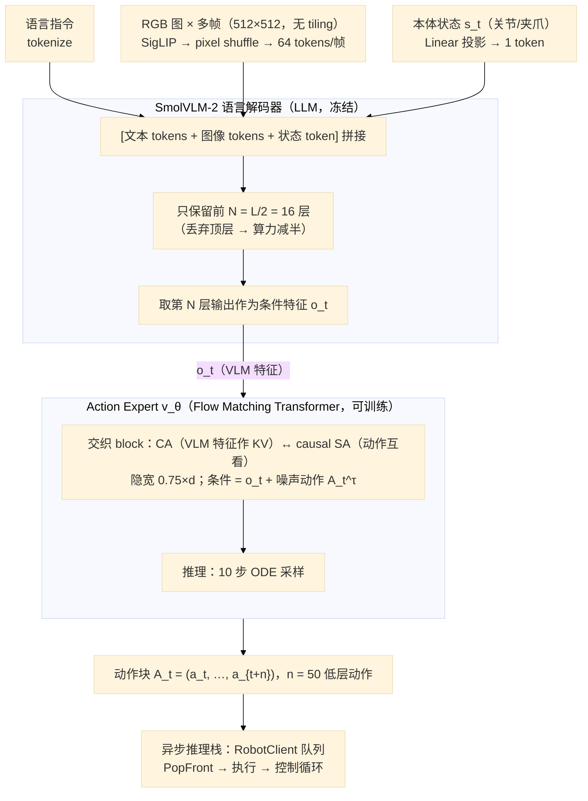
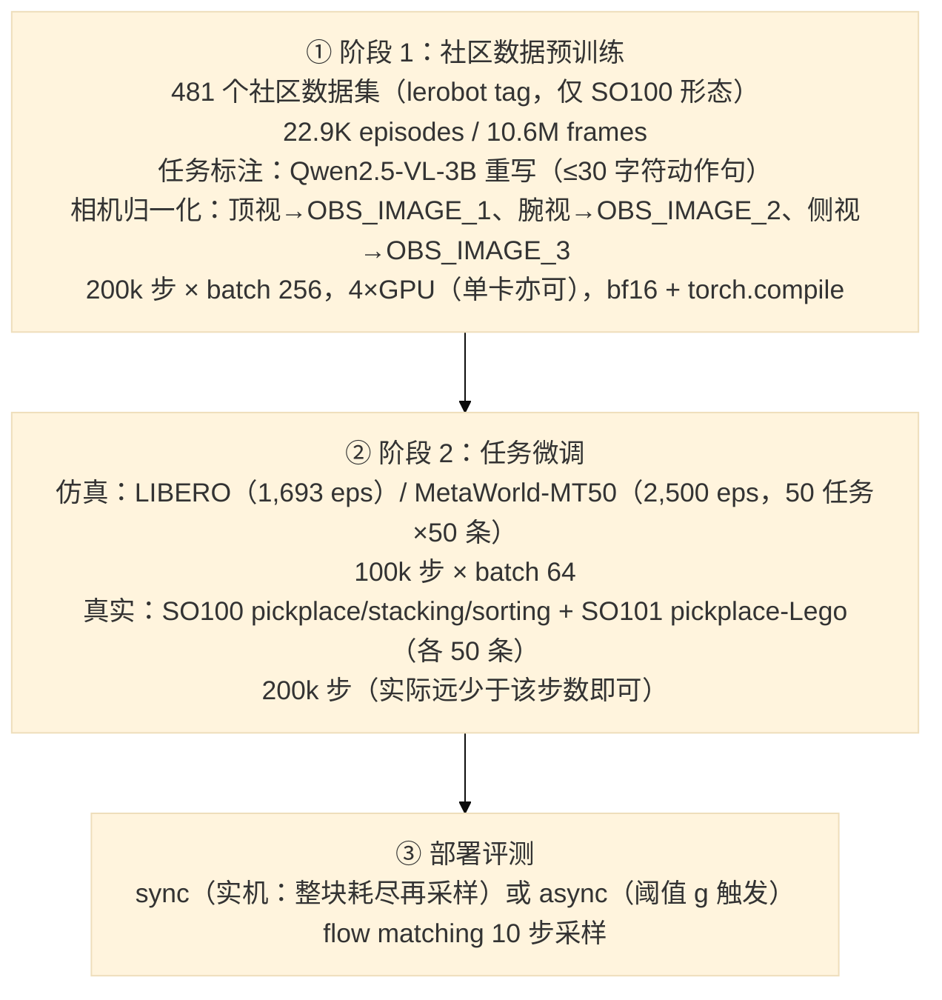
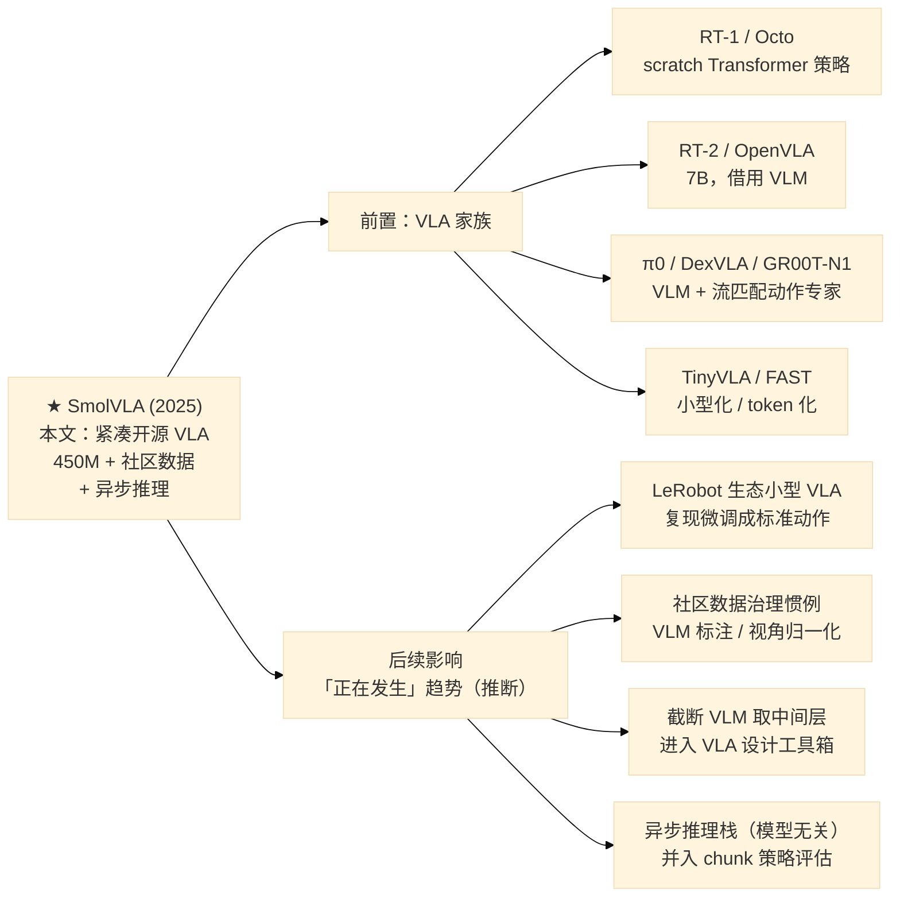

# SmolVLA: A Vision-Language-Action Model for Affordable and Efficient Robotics

> **一句话总结：** 这篇论文提出 **SmolVLA**——一个仅 **450M 参数**（其中动作专家约 100M）的紧凑 VLA 模型，证明了"小模型 + 社区数据 + 聪明剪枝"可以撼动"大模型 + 海量专有数据"的 VLA 范式：只保留预训练 VLM（SmolVLM-2）的**前一半层**做感知、用 **Flow Matching 动作专家**做动作生成，仅在 **481 个 HuggingFace 社区数据集（22.9K episodes，比 SOTA 少一个数量级）** 上预训练，即可在 LIBERO / Meta-World / 真实 SO-100/101 上**对齐甚至超越大它 ~7–10× 的 π0 / OpenVLA**；配套的**异步推理栈**把"感知-预测"与"动作执行"解耦，让低端机器人以更少算力获得 ~30% 更快、固定时间 2× 通量的响应能力。

> **⚙️ 配套复现：** 本工程 SmolVLA 复现实验**正在进行中**，记录骨架见 [code/reproduction_smolvla.md](../../code/reproduction_smolvla.md)（实验数据待回填）；笔记中标注 🔁 处与复现文档对应。

## 1. Paper Information

- **标题**: SmolVLA: A Vision-Language-Action Model for Affordable and Efficient Robotics
- **作者**: Mustafa Shukor (Hugging Face), Dana Aubakirova (Hugging Face), Francesco Capuano (Hugging Face), Pepijn Kooijmans (Hugging Face), Steven Palma (Hugging Face), Adil Zouitine (Hugging Face), Michel Aractingi (Hugging Face), Caroline Pascal (Hugging Face), Martino Russi (Hugging Face), Andres Marafioti (Hugging Face), Simon Alibert (Hugging Face), Matthieu Cord (Sorbonne University / valeo.ai), Thomas Wolf (Hugging Face), Remi Cadene (Hugging Face, École Normale Supérieure Paris-Saclay)（\* 为核心团队）
- **发表**: arXiv preprint (cs.LG) 2025-06-02（arXiv:2506.01844v1；非正式会议，HF 团队官方博客同步发布）
- **链接**: [arXiv](https://arxiv.org/abs/2506.01844) | [Code（LeRobot，含 smolvla policy）](https://github.com/huggingface/lerobot) | [Blog](https://huggingface.co/blog/smolvla) | [基座模型 lerobot/smolvla_base](https://huggingface.co/lerobot/smolvla_base) | [评测数据（SO100/SO101）](https://huggingface.co/lerobot) | [SO-ARM100 硬件](https://github.com/TheRobotStudio/SO-ARM100)

---

## 2. Motivation

### 2.1 Background

- **VLA 是通用机器人策略的主流方向，但普遍"大而贵"**：把预训练 VLM 改造成 vision-language-action 模型（输入多模态观测 + 语言指令 → 输出动作）带来了语言驱动的感知与控制泛化。但现有 VLA（OpenVLA 7B、π0 3.3B、GR00T 等）动辄数十亿参数，训练依赖大规模算力、部署受限于昂贵平台，**绝大多数研究者负担不起、也无法在低端机器人上实时运行**。
- **数据被"学术/工业专有"垄断，社区数据被忽视**：现有 VLA 依赖 Open X-Embodiment 这类学术/工业大库；而随着 SO-100 这类 $100 级开源机械臂 + LeRobot 等标准化库普及，社区成员在 HF Hub 上（`lerobot` tag 下）持续贡献了大量**廉价、多样、真实**的遥操作数据——这些数据噪声大、形态杂、标注乱，此前没有 VLA 认真用过。
- **机器人数据存在"数据孤岛"（data islands）**：不同机器人形态、传感器、控制频率、数据格式差异巨大（Bjorck et al. 2025），整合跨形态数据困难；数据规模比文本/视觉少几个数量级，且严重依赖专家遥操作采集。
- **VLA 研究开源程度不足**：大量 impactful 进展只开源权重、不开源训练配方与工程细节；RT-2-X / OpenVLA 等开放尝试依然庞大、资源密集、依赖昂贵平台。
- **大 VLM 的全量推理对机器人控制是浪费**：已有工作（El-Nouby et al. 2024; Bolya et al. 2025; Rajasegaran et al. 2025）指出**下游任务最好的特征不一定在 VLM 最后一层**——这为"截断 VLM 层数"提供了依据。

### 2.2 Goal

> **能否做出一个"小、开源、社区数据驱动"的 VLA——单 GPU 可训练、消费级 GPU 甚至 CPU 可部署、可控制低成本机器人，且性能对齐比它大一个数量级的 VLA？**

### 2.3 核心洞察

- **效率不是靠换架构，而是靠"删"与"拆"**：在**冻结的**紧凑 VLM（SmolVLM-2）上，只取**前 L/2 层特征**喂给动作专家（扔掉最后 L−N 层，剪刀符号）、视觉 token 压到每帧 64 个（不用 tiling）——感知用冻结 VLM、动作用可训专家，两者各司其职，把"改大模型"变成"只训小头"。
- **社区数据够用，但需要"洗"**：481 个社区数据集体量虽小（22.9K episodes），只要做好**任务标注清洗**（用 VLM 重写噪声指令）与**相机视角归一化**（统一命名与顺序），就能支撑起可迁移的通用技能预训练。
- **低端机器人的瓶颈是"响应速度"而非"模型大小"**：同步推理（等整块动作耗尽再重规划）在算力受限端机会成本巨大；把动作预测与动作执行**解耦成异步流水线**（客户端只管执行、服务器端并行推理），可以在几乎不掉成功率的情况下把响应延迟与通量提升数倍。此设计**模型无关**，任何输出动作块的策略都适用。

---

## 3. Core Ideas

### ① 紧凑 VLA 架构：冻结小 VLM + Flow Matching 动作专家

感知交给**冻结的 SmolVLM-2**（SigLIP 视觉编码 + SmolLM2 语言解码），动作交给可训练的 **Flow Matching Transformer 动作专家**；仅用 VLM **前 N=L/2 层**特征（主模型 LLM 只留前 16 层）、每帧仅 64 个视觉 token。总参 450M（专家 ~100M）。为什么重要：**系统性证明 0.45B 级 VLA 即可比肩 10× 大模型**，把 VLA 的"入场费"从多卡集群降到单张消费级 GPU / MacBook / CPU 推理。

### ② 社区数据预训练：481 个 HF 数据集，比 SOTA 少一个数量级

端到端预训练只用 481 个 `lerobot` tag 社区数据集（22.9K episodes / 10.6M frames，**单一 SO100 形态**），配 Qwen2.5-VL-3B 自动重写任务标注 + 手动相机视角归一化。为什么重要：**证明"去中心化社区数据 + 低成本硬件"足以替代专有大规模机器人数据**——即便面对从未见过的 SO101 形态也能迁移。

### ③ Flow Matching 动作专家 + 交织 CA/SA 注意力

动作专家每个 block **只含 cross-attention 或 causal self-attention 之一、交错排列**（区别于纯 SA / 纯 CA / 标准 VLM 的"SA+CA 同块"）：CA 让动作 token 读取 VLM 特征（KV），causal SA 让块内动作 token 互相看（禁止未来泄漏），消融显示 CA+SA 交错 > 纯 CA > 纯 SA（85.5 vs 79.0 vs 74.5）；训练目标用 Flow Matching（显著优于回归 L1，80.25 vs 75.25）。为什么重要：**在不牺牲性能的前提下把动作生成做到轻量**（专家隐宽仅 0.75×VLM 维度）。

### ④ 异步推理栈：动作执行与"感知+预测"解耦

RobotClient/PolicyServer 双端：客户端消费动作队列，当剩余动作比例跌破阈值 g（如 0.7）即触发新的观测→推理；关节空间相似度过滤避免冗余推理；推理未完成则沿用旧队列。为什么重要：**算力受限的低成本机器人也能获得高响应频率**——成功率几乎不变（78.3 vs 73.3），任务完成时间 −30%（13.75s → 9.7s），固定时间完成数 2×（9 → 19 个 pick-place 循环）。

---

## 4. Overall Framework

### 数据流（Inference Path）



> 训练/推理分工：**预训练与微调只更新 action expert 的 ~100M 参数，VLM 全程冻结**（仅提供感知特征）。Figure 1 论文架构图与本图一致（图源：[arXiv HTML](https://arxiv.org/html/2506.01844)）。

### 训练数据组织（两阶段，无在线交替）



---

## 5. Key Modules

### 5.1 VLM 骨干（SmolVLM-2，冻结）

#### Motivation

VLM 预训练积累了丰富的视觉-语言世界知识，是机器人"常识"的免费来源；但全量跑大 VLM 又贵又慢。要既保留世界知识、又控制算力，就得"挑着用"。

#### 核心思想

- 选择 **SmolVLM-2**（Marafioti et al. 2025）：本身就为多图/视频优化的小型 VLM（SigLIP 视觉编码 + SmolLM2 语言解码器）。
- **层跳过（Layer skipping）**：丢弃 VLM 最后 L−N 层（论文图 1 的剪刀符号）。依据："下游任务最好的特征不必然在最后一层"（El-Nouby et al. 2024; Bolya et al. 2025）。主模型取 **N=16 = L/2**（SmolVLM-2 500M 的 LLM 为 32 层），LLM 与动作专家算力各减半。
- **视觉 token 最小化**：不用 SmolVLM-2 的 image tiling（多 crop），只用全局图 + **pixel shuffle**，**每帧压到 64 个 token**。
- 消融：截前 16 层 vs 每 2 层跳 1 层（Skip%2，75.5）vs 换更小 VLM（VLM-256M，75.8）——**截前 N 层最优**（详见 §8 Table 8）。

> **一句话总结：** 冻结的紧凑 VLM + "只留前一半层 + 每帧 64 token"，用最小推理开销换取足够的感知与世界知识——这是 SmolVLA 能在 450M 总量下工作的第一根支柱。

### 5.2 Action Expert（Flow Matching Transformer）

#### Motivation

动作生成需要处理**多模态、多峰**的人类演示分布。回归（L1）会把多模态平均成"四不像"；扩散/流匹配能显式建模分布。但 π0 式的自回归扩散专家较重，需要更轻、更快的条件化方式。

#### 核心思想

- **Flow Matching 目标**：训练 v_θ 回归从噪声到数据的线性插值路径的速度场 u（公式见 §6），推理用固定 **10 步** ODE 采样；τ 从 Beta 分布采样（与 π0 一致）。
- **交织 CA/SA**：动作专家的每个 block 只含一种注意力——**CA block** 让动作 query 读 VLM 特征（KV），**causal SA block** 让动作 token 块内互看（掩码禁止"看未来动作"）。区别于纯 SA（π0）、纯 CA（GR00T 类）或同块 SA+CA（标准 VLM）。
- **尺寸**：专家隐宽 0.75×d（d 为 VLM 隐维），主模型约 100M 参数。
- 直觉：CA 负责"读条件"（VLM 特征），SA 负责"把动作块做连贯平滑"——消融显示 SA 对**实机上动作块的平滑性**贡献明显。

> **一句话总结：** 一个"只训小头、条件化极轻"的流匹配动作生成器——CA 读 VLM、causal SA 做块内连贯，用 ~100M 参数完成 10× 大模型的动作生成任务。

### 5.3 社区数据处理：VLM 标注清洗 + 相机视角归一化

#### Motivation

社区数据是"脏"的：任务描述大量是占位符（`task desc`）、过泛指令（`Hold`、`Up`）甚至缺失；相机命名五花八门（`images.laptop` 可能是顶视/侧视/腕视）。直接训练会严重损害指令跟随与跨数据集迁移。

#### 核心思想

- **任务标注重写**：对每个数据集采样代表帧 + 原指令，用现成 VLM **Qwen2.5-VL-3B-Instruct** 生成一条 ≤30 字符的动作导向句（prompt 见论文附录 A.1，要求以 `Pick`/`Place`/`Open` 等动词开头）。
- **相机视角归一化**：人工把每个相机映射到标准视角并按优先级命名——**顶视 → `OBS_IMAGE_1`、腕视 → `OBS_IMAGE_2`、侧视 → `OBS_IMAGE_3`**；多余视角丢弃、保留顺序。实验发现一致的相机顺序在小数据 regime 下显著有益。

> **一句话总结：** "标注去噪 + 视角归一化"是把 22.9K 条异构社区数据变成可用预训练语料的预处理管线——数据的可用性靠清洗，而非堆量。

### 5.4 异步推理栈（RobotClient / PolicyServer）

#### Motivation

同步推理（sync）等整块 n 步动作耗尽才重新"看+想"，块间存在"盲飞"；而 π0/ACT 式的每步推理（g=1 极限）在 CPU/低端部署上算力不可承受。低成本机器人的瓶颈是响应速度与算力预算的矛盾。

#### 核心思想

- **解耦架构**：RobotClient 端持续 PopFront 执行动作；当队列剩余比例 `|A_t|/n < g`（论文默认 g=0.7）时抓取新观测发往（可远程的）PolicyServer 异步推理；服务器完成后返回新块 `Ã`，用聚合函数 f 把新旧块在重叠区间合并；**推理未完则继续沿用旧队列**（Algorithm 1，见 §8）。
- **观测相似度过滤**：在**关节空间**比较相邻观测，近重复（距离 < ε）则丢弃，避免对几乎相同的状态反复推理导致队列抖动；队列清空时强制处理最近观测。
- **g 的物理含义**：g→0 退化为全同步（有 ~E[ℓ_S] 的空闲盲区）；g→1 退化为每步推理（最敏感但每 tick 一次前向）。中间值用重叠缓冲建模误差、摊薄算力。避免队列耗空需 `g ≥ (E[ℓ_S]/Δt)/n`（30fps 时 Δt=33ms）。
- **收益**：与 sync 成功率几乎持平，但任务完成时间 −30%（13.75→9.7s）、固定时间完成数 2×（9→19）；远程服务器部署还允许"机器人端省电 + 服务器端上 GPU"。

> **一句话总结：** 用"队列阈值触发 + 相似度过滤 + 重叠聚合"把 chunk 策略从开环盲飞变成准闭环，模型无关、几乎零成功率代价——这是 SmolVLA 面向低成本硬件的第二根支柱。

---

## 6. Mathematical Formulation

### 符号说明

| 符号 | 含义 | 维度 |
|------|------|------|
| $o_t$ | t 时刻观测（多张 RGB + 语言指令 + 本体状态） | 图像 512×512×3×C + tokens |
| $\mathbf{o}_t$ | VLM 第 N 层输出的条件特征（喂给动作专家） | d |
| $\mathbf{A}_t=(a_t,\ldots,a_{t+n})$ | 动作块（chunk） | n×dim(a) |
| $\varepsilon$ | 标准高斯噪声 | n×dim(a) |
| $\mathbf{A}_t^\tau$ | 噪声与动作的线性插值（加噪动作） | n×dim(a) |
| $\tau$ | 插值时间参数，$\tau\sim\mathrm{Beta}$ | [0,1] |
| $\mathbf{v}_\theta(\cdot)$ | 动作专家（flow matching Transformer） | — |
| $\mathbf{u}(\mathbf{A}_t^\tau\mid\mathbf{A}_t)$ | 条件最优速度场（回归目标） | n×dim(a) |
| $n$ | 动作块长度（chunk size） | 50（主配置） |
| $g$ | 异步推理队列阈值 | [0,1]，默认 0.7 |
| $\epsilon$ | 关节空间近重复判定距离 | $\mathbb{R}_{+}$ |
| $\ell_S$ / $t_{C\to S}$ / $t_{S\to C}$ | 推理延迟 / 客户端→服务器 / 服务器→客户端传输时间 | ms |
| $\Delta t$ | 控制周期 | 33ms（30fps） |
| $L$ / $N$ | VLM 总层数 / 保留层数 | 32 / 16（主模型） |
| $d$ | VLM 隐维度 | — |

### Flow Matching 训练目标（核心公式）

动作专家把"从噪声到动作"建模为概率路径，训练目标是让 v_θ 拟合线性插值路径的最优速度场（整流流形式，Liu 2022; Lipman et al. 2022；与 π0 的流匹配设置一致）：

$$\mathcal{L}^{\tau}(\theta) \;=\; \mathbb{E}_{\,p(\mathbf{A}_t \mid \mathbf{o}_t),\; q(\mathbf{A}_t^{\tau} \mid \mathbf{A}_t)} \left[\, \big\| \mathbf{v}_{\theta}\big(\mathbf{A}_t^{\tau},\; \mathbf{o}_t\big) \;-\; \mathbf{u}\big(\mathbf{A}_t^{\tau} \mid \mathbf{A}_t\big) \big\|^2 \,\right]$$

其中加噪动作与目标速度场定义为：

$$\mathbf{A}_t^{\tau} = \tau\,\mathbf{A}_t + (1-\tau)\,\varepsilon,\qquad \varepsilon \sim \mathcal{N}(0,\mathbf{I})$$

$$\mathbf{u}\big(\mathbf{A}_t^{\tau} \mid \mathbf{A}_t\big) \;=\; \varepsilon - \mathbf{A}_t$$

- **直观理解**：τ=1 时 A^τ=A（干净动作），τ=0 时 A^τ=ε（纯噪声）。v_θ 学会给出"从当前插值点指向数据端（−u）"的方向；把回归目标写成 ε−A_t 只是方向约定，与指向数据端差一个负号、回归等价。
- **为什么是流匹配而非回归**：单一动作块的目标分布是多模态的（同一指令不同示范轨迹）；L1 回归取"平均"会抹平模式，流匹配保留分布。消融：80.25 vs 75.25（Table 10）。
- **推理**：从 ε~N(0,I) 出发沿学到的速度场做 **10 步**（固定）Euler 积分去噪得到动作块。

### 异步推理的队列守恒分析

记一次完整往返延迟 $\ell = t_{C\to S} + \ell_S + t_{S\to C}$（双向传输近似相等且远小于推理延迟时 $\mathbb{E}[\ell] \simeq \mathbb{E}[\ell_S]$）。**避免队列耗空（机器人空转等待）的条件**为：

$$g \;\geq\; \frac{\mathbb{E}[\ell_S]\,/\,\Delta t}{\,n\,}$$

- **直观理解**：推理一次耗时 E[ℓ_S] 相当于 E[ℓ_S]/Δt 个控制 tick；若在队列还剩余 g·n 个动作时触发推理，只要 `剩余动作数 ≥ 推理耗时(ticks)` 队列就不会空——阈值 g 越高、块长 n 越大，越不容易空转，但每块分摊的推理越频繁/越贵。
- 不设相似度过滤时，客户端每 $(1-g)\,n\cdot\Delta t$ 秒发一次观测、每 $(1-g)\,n\cdot\Delta t + \mathbb{E}[\ell_S]$ 秒收到新块；相似度过滤会**拉长**触发间隔，避免队列被"近相同动作"反复刷新导致空转（Figure 3(B) 的红箭头是队列空时强制处理近重复观测的时刻）。

### 训练目标 / Loss 汇总

| Loss | 形式 | 说明 |
|---|---|---|
| Flow Matching loss | $\mathbb{E}\big[\|\mathbf{v}_\theta(\mathbf{A}_t^\tau,\mathbf{o}_t) - (\varepsilon - \mathbf{A}_t)\|^2\big]$ | 动作专家唯一训练目标；τ~Beta |
| （无其他辅助损失） | — | VLM 冻结无 LM loss；无 KL/正则项 |

---

## 7. Training Pipeline

```
─────────────────────────────────────────────────────────────
Algorithm 1: SmolVLA 训练（预训练阶段；微调同构、步数更少）
─────────────────────────────────────────────────────────────
 1:  Given: 社区数据集 D（481 数据集，任务标注已用 Qwen2.5-VL-3B 清洗，
             相机已归一化 OBS_IMAGE_1/2/3）
 2:  载入 SmolVLM-2，冻结；截断至前 N=L/2 层
 3:  初始化动作专家 v_θ（交织 CA/causal SA，隐宽 0.75×d）
 4:  for step = 1 .. 200,000 do
 5:      采样 batch（全局 batch 256；图像 resize 512×512）
 6:      o_t ← VLM_forward(图 tokens + 文本 tokens + 状态 token)[第 N 层]   # 冻结
 7:      τ ~ Beta;  ε ~ N(0,I);  A_t^τ ← τ·A_t + (1−τ)·ε
 8:      L ← ‖v_θ(A_t^τ, o_t) − (ε − A_t)‖²                    # flow matching
 9:      仅更新 θ（AdamW β=(0.9,0.95)；cosine 1e-4→2.5e-6；100 步 warmup）
10:  # bf16 + torch.compile + accelerate；固定序列长度（超长 episode 丢帧）
─────────────────────────────────────────────────────────────
```

**超参数表（论文 §4.3 与官方实现）**：

| 超参 | 预训练值 | 微调值（仿真 / 真实） | 备注 |
|---|---|---|---|
| 模型总量 | 450M（~100M 动作专家） | 同左 | 另有 0.24B / 2.25B 变体 |
| VLM 骨干 | SmolVLM-2（500M 级，冻结） | 冻结 | 仅用 LLM 前 16 层（L=32） |
| 视觉 token | 64/帧（pixel shuffle，无 tiling） | 同左 | 输入 512×512 |
| chunk size n | 50 | 50 | 消融 10–50 最优带 |
| 训练步数 | 200,000 | 100,000 / 200,000 | 论文注：远少于此步数也够 |
| batch size | 256（global） | 64 / — | 预训练 4×GPU |
| 学习率 | cosine 1e-4 → 2.5e-6 | — | 100 步 warmup |
| 优化器 | AdamW β=(0.9, 0.95) | — | bf16 混合精度 |
| 推理采样 | — | flow matching 10 步 | 固定步数 |
| 其他 | torch.compile、固定 seq len、accelerate | — | 项目总量 ~30k GPU hours |
| 观测频率（实机） | — | sync：整块耗尽后采样；仿真：每步采样 | async 模式阈值 g=0.7 |

**论文与实现核对表**（读这篇论文容易踩的坑 / 需要留意的口径差异）：

| # | 论文写法 | 备注 / 实际 |
|---|---|---|
| 1 | 宣称"性能对齐大 10× 模型" | 论文的 10× 口径主要对比 π0（3.3B≈7.3×450M）与 OpenVLA（7B≈15×）；"10×"是量级描述，不同基准数字要按表逐一核对 |
| 2 | 消融（§4.7）"模型从零训练、无机器人数据预训练" | 指不做社区数据预训练，但 VLM 权重仍是预训练初始化且**冻结**；且消融在 LIBERO 上跑，与 Table 2 主结果（同样 No-VLA-Pt 却高 ~7 点）**口径存在出入**（论文未解释；可能涉及 multitask 评测设置/随机性差异），转述消融数字时不要与 Table 2 混算 |
| 3 | Table 9（专家容量）正文结论"0.75×d 是效率-性能平衡" | 表内 ×1.00 平均最高（82.3）、×0.5（80.3）反而高于 ×0.75（77.5）——"越大越好"在表中并不单调，0.75d 更像工程折中而非性能最优，引用时以原始数据为准 |
| 4 | 真实任务"微调 200,000 步" | 论文明确"实际远少于此步数即可"——复现/学习时步数不是硬指标 |
| 5 | 预训练数据表 1 注释写"~10M episodes" | 表 1 实际数字是 22.9K episodes / 10.6M **frames**；正文同段又写"~10M"，应为 "10.6M frames（episodes 23k）" 的笔误口径，以表格数值为准 |
| 6 | 异步 vs 同步成功率 | Figure 5：Pick-Place 上 Async 80 > Sync 75，但 Sorting 上 Async 50 < Sync 70，平均 73.3 < 78.3——**异步快≠更强**，收益在时延/通量而非成功率，别把两表混为一谈 |
| 7 | SmolVLM-2 / SmolVLM 命名 | 论文正文引 SmolVLM-2（Marafioti et al. 2025 题为 SmolVLM），HF 仓库路径 `lerobot/smolvla_base` 为基座权重 |

> **🔁 对照复现**：本工程复现实验进行中，resolved 配置与论文差异（数据集/步数/评测口径）待复现文档回填后在此对照：见 [reproduction_smolvla.md §4](../../code/reproduction_smolvla.md)。

---

## 8. Inference / Planning

### 同步推理（sync）

```
─────────────────────────────────────────────────────────────
sync 控制循环（实机默认；论文 §4.3）
─────────────────────────────────────────────────────────────
 1:  o_t ← 采样观测（图+语言+状态）
 2:  A_t ← Sample( v_θ, o_t, 10 步 flow matching )      # 预测整块 n=50
 3:  for i = 1 .. n do
 4:      a ← PopFront(A_t);  Execute(a)                  # 整块耗尽前不再“看”
─────────────────────────────────────────────────────────────
```

### 异步推理（async，Algorithm 1）

```
─────────────────────────────────────────────────────────────
Algorithm 1: Asynchronous inference control-loop
─────────────────────────────────────────────────────────────
 1:  Input: horizon T, chunk size n, threshold g ∈ [0,1]
 2:  Init: capture o_0; send o_0 to PolicyServer; receive A_0 ← π(o_0)
 3:  for t = 1 .. T do
 4:      a_t ← PopFront(A_t)                            # 只管执行
 5:      Execute(a_t)
 6:      if |A_t|/n < g then                            # 队列低于阈值
 7:          capture 新观测 o_{t+1}
 8:          if NeedsProcessing(o_{t+1}) then           # 关节空间相似度过滤
 9:              async_handle ← AsyncInfer(o_{t+1})     # 非阻塞触发
10:              Ã_{t+1} ← π(o_{t+1})                    # 服务器端出新块
11:              A_{t+1} ← f(A_t, Ã_{t+1})               # 重叠区间聚合
12:          endif
13:      endif
14:      if NotCompleted(async_handle) then
15:          A_{t+1} ← A_t                              # 推理未完→沿用旧队列
16:      endif
17:  endfor
─────────────────────────────────────────────────────────────
```

g 的三个 regime（Figure 3）：g=0 全同步（推理往返期机器人空转 E[ℓ_S]）；g=0.7 异步（耗尽 ~30% 前触发新推理，重叠缓冲误差）；g=1 每步推理（最敏感、每 tick 一次前向，低端硬件不可承受）。**默认 g=0.7**。

### 仿真主结果（论文 Table 2，成功率 %；VLA Pt = 是否做过机器人数据预训练）

**LIBERO（40 任务：Spatial/Object/Goal/Long 各 10，每任务 10 trials）**

| 策略（参数量） | VLA Pt | S | O | G | Long | Avg |
|---|---|---|---|---|---|---|
| Diffusion Policy | No | 78.3 | 92.5 | 68.3 | 50.5 | 72.4 |
| Octo (0.09B) | Yes | 78.9 | 85.7 | 84.6 | 51.1 | 75.1 |
| OpenVLA (7B) | Yes | 84.7 | 88.4 | 79.2 | 53.7 | 76.5 |
| π0 (Paligemma-3B) | No | 87 | 63 | 89 | 48 | 71.8 |
| π0 (3.3B, 预训练 10,000h) | Yes | 90 | 86 | 95 | 73 | **86.0** |
| **SmolVLA (0.24B)** | No | 87 | 93 | 88 | 63 | 82.75 |
| **SmolVLA (0.45B)** | No | 90 | 96 | 92 | 71 | **87.3** |
| **SmolVLA (2.25B)** | No | 93 | 94 | 91 | 77 | **88.75** |

**Meta-World（MT50，50 任务按难度分 4 档，每任务 10 trials）**

| 策略（参数量） | VLA Pt | Easy | Medium | Hard | Very Hard | Avg |
|---|---|---|---|---|---|---|
| Diffusion Policy | No | 23.1 | 10.7 | 1.9 | 6.1 | 10.5 |
| TinyVLA | No | 77.6 | 21.5 | 11.4 | 15.8 | 31.6 |
| π0 (3.5B-Paligemma) | No | 80.4 | 40.9 | 36.7 | 44.0 | 50.5 |
| π0 (3.5B, 预训练) | Yes | 71.8 | 48.2 | 41.7 | 30.0 | 47.9 |
| **SmolVLA (0.24B)** | No | 86.43 | 46.36 | 35 | 60 | 56.95 |
| **SmolVLA (0.45B)** | No | 82.5 | 41.8 | 45.0 | 60.0 | 57.3 |
| **SmolVLA (2.25B)** | No | 87.14 | 51.82 | 70 | 64 | 68.24 |

> 口径：SmolVLA 全部 **只从 VLM 初始化、无机器人数据预训练**，仍然在 LIBERO 上超过有 10,000h 预训练的 π0-3.3B（0.45B：87.3 vs 86.0）并在 MetaWorld 各档全面领先所有基线；相对 π0 约 **快 40% 训练、省 6× 内存**。

### 真实任务主结果（SO100，细粒度评分；论文 Table 3/4，成功率 %）

**SO100 三任务**（Pick-Place=0.5 抓+0.5 放；Stacking=0.5+0.5；Sorting=4×0.25）

| 策略 | 训练方式 | Pick-Place | Stacking | Sorting | Avg |
|---|---|---|---|---|---|
| ACT (80M) | 单任务 | 70 | 50 | 25 | 48.3 |
| π0 (3.5B) | 多任务 | 100 | 40 | 45 | 61.7 |
| **SmolVLA (0.45B)** | 多任务 | 75 | 90 | 70 | **78.3** |

**SO101 Pick-Place-Lego（未见形态/小物体+透明盒，更需精度；单任务训练）**

| 策略 | In Distribution | Out of Distribution |
|---|---|---|
| ACT | 70 | 40 |
| **SmolVLA (0.45B)** | 90 | 50 |

> SmolVLA **未在 SO101 数据上预训练**，微调后 ID/OOD 均超 ACT；OOD = Lego 出现在训练未见过的新位置。

### 预训练与多任务微调的影响（论文 Table 5，SO100 三任务）

| 训练方式 | 社区预训练 | Pick-Place | Stacking | Sorting | Avg |
|---|---|---|---|---|---|
| 单任务 | No | 55 | 45 | 20 | 40 |
| 多任务 | No | 80 | 40 | 35 | 51.7 |
| 多任务 | **Yes** | 75 | 90 | 70 | **78.3** |

> 社区预训练带来 **+26.6 个点**（51.7→78.3），多任务微调在低数据 regime 下也有显著增益——这是"社区数据预训练有效"的直接证据。

### 异步 vs 同步（论文 Figure 5，Pick-Place 上优化、跨任务复用超参）

| 指标 | Sync | Async |
|---|---|---|
| 成功率 Avg（三任务） | 78.3 | 73.3 |
| 任务完成时间（10 trials） | 13.75 ± 2.42 s | **9.70 ± 2.95 s（~30% 快）** |
| 固定 60s 内完成数 | 9（1.8/次） | **19（3.8/次，2×）** |

> 定性：async 对环境扰动/物体移位反应更快、恢复更强；成功率逐任务有升（Pick-Place 80 vs 75）有降（Sorting 50 vs 70），**核心收益是时延与通量**（见 §7 核对表 #6）。

### 消融结论（论文 Table 6–13，全部在 LIBERO，从零训练无机器人预训练、VLM 冻结；每行给数字依据）

- **VLM×专家交互（T6）**：CA+SA 交织 85.5 > 纯 CA 79.0 > 纯 SA 74.5——交错注意力是关键设计。
- **动作 token 注意力掩码（T7）**：causal 74.5 > bidirectional 67.5——禁止未来动作泄漏带来 +7 点。
- **VLM 层数/剪枝策略（T8）**：前 N=16 层 78.5、N=32 层 80.3（全层上限）；Skip%2（隔层跳）75.5、换 VLM-256M 75.8——**截前 N 层优于"减密度"与"换小模型"**，N=L/2 是性能/算力甜点。
- **专家容量（T9）**：×1.00 82.3 / ×0.75 77.5 / ×0.50 80.3 / ×0.25 73.8——论文选 0.75d 作工程折中（数据非单调，见 §7 核对表 #3）。
- **训练目标（T10）**：Flow Matching 80.25 > 回归 L1 75.25——流匹配对多模态动作分布是更好的归纳偏置。
- **状态喂给谁（T11）**：喂 VLM（prefix）+CA 80.3 最佳；状态直接进专家（suffix）+SA 74.8、+CA 73.3；prefix+SA 仅 53.3——**本体状态必须走 VLM 而非动作专家**。
- **chunk size（T12）**：n=10 达 84.0 峰值，n=50 为 80.3，n=1 崩到 50.0、n=100 降到 74.5——10–50 是响应性与稳定性的平衡带。
- **动作执行步数（T13，每执行 k 步才采样新观测）**：1 步 80.3 / 10 步 82.8 / 30 步 70.8 / 50 步 51.8——**观测更新越频繁越好**，但也解释了 sync 推理（整块 50 步）在实机为何会损失部分反应性。

> **🔁 对照复现**：本工程复现实验进行中，计划以（用户实验配置，如 LeRobot + smolvla policy + SO100/SO101 数据集）为口径对照论文 Table 3/4/5 与消融结论，差异与数字待回填：见 [reproduction_smolvla.md](../../code/reproduction_smolvla.md)。

---

## 9. Limitations

1. **预训练只覆盖单一机器人形态（SO100）**：481 个数据集全部来自同一种低端机械臂；跨形态能力只靠"VLM 冻结特征 + 微调"硬扛（SO101 的迁移虽成功，但只证明近邻形态可行）。为什么是局限：真正通用需要跨形态数据混合（GR00T/π0 式的 cross-embodiment），论文明说这是后续关键。
2. **数据规模小一个数量级**：23K episodes 对 OpenVLA ~1M trajectories 量级而言仍是"小样本"；性能天花板与长尾泛化可能受数据量压制。为什么是局限：无法判断当前成绩是"架构红利"还是"数据尚未到瓶颈"，扩大数据是否线性受益未验证。
3. **VLM 骨干"出身"不匹配机器人**：SmolVLM-2 主要在文档阅读/OCR 类数据上预训练，不是为实时视觉-运动控制设计的；为什么是局限：视觉编码（如透明物体、微小目标）与低延迟需求未必最优，需要更对齐机器人场景的骨干或预训练策略。
4. **任务复杂度停留在短时程**：评测均为单步/短时程操作（pick-place、stacking、sorting、LIBERO Long 也只到分钟级）；为什么是局限：长时程需要层级策略/规划/记忆，当前单策略直接输出 50 步块的方式无法扩展。
5. **纯模仿学习、无 RL/自主改进**：性能上限被演示质量钉死，无法通过试错自我修正；复杂/灵巧任务的提升需要 VLA+RL（论文引 ConRFT 等方向）。
6. **多模态与机器人数据未联合训练**：VLM 权重冻结意味着机器人训练无法反向改进感知/语言能力；联合训练（shared training）是论文指出的未竟方向。
7. **异步推理对"坏模型"更脆**（隐含）：async 的收益依赖"队列中剩余动作可信"——若策略在未见状态上预测质量差，重叠聚合会把坏动作多执行一段；g 与相似度阈值 ε 是需要在任务上重新调的敏感超参。

这些局限共同指向后续方向：**跨形态社区数据扩展、更大规模开源数据、对齐机器人场景的骨干、VLA+RL、层级化长时程控制**——VLA 的"小而强"路线仍有大量待填空间。

---

## 10. Relationship

### 历史脉络



### 承上：对前作的改进（与关键基线的系统对比）

| 维度 | π0 (Black 2024) | OpenVLA (Kim 2024) | Octo | TinyVLA | **SmolVLA** |
|---|---|---|---|---|---|
| 参数量 | 3.3B | 7B | 0.09B | <1B（scratch） | **450M（专家仅 100M）** |
| 骨干 | PaliGemma-3B | Prismatic-7B | scratch Transformer | scratch 多模态 | **SmolVLM-2（冻结，截前 16 层）** |
| 动作生成 | Flow Matching（大 expert） | 离散 token | 离散 | 回归 | **Flow Matching（0.75d 小 expert）** |
| 动作块内注意力 | SA | — | — | — | **交织 CA + causal SA（消融最优）** |
| 机器人数据预训练 | 10,000h 专有 | Open X-Embodiment | 跨形态 | 无大规模 | **481 社区数据集 23K eps（单一 SO100）** |
| 训练成本 | 多卡集群 | 多卡集群 | — | 低 | **单 GPU 可训（bf16+compile）** |
| 推理部署 | GPU 集群 | GPU | GPU | GPU | **消费级 GPU / CPU** |
| 推理模式 | — | — | — | — | **sync + 模型无关 async 双模式** |
| 开源 | 权重 | 权重+数据 | 权重 | 部分 | **权重+代码+数据+硬件+配方全开源** |

要点：前人要么大而专有（π0/OpenVLA），要么小但无机器人数据预训练/无生成式动作建模（TinyVLA）。SmolVLA 首次把"小骨干 + 生成式动作 + 社区数据预训练 + 异步推理"组合在一起，且全链路开源。

### 启下：对后续工作的影响

1. **降低 VLA 复现门槛**：单卡可训 + 全开源配方，使普通实验室/个人能在自有 SO-100/101 上复现并对比（本工程即在此路线上复现 ACT 后跟进 SmolVLA）。
2. **社区数据被"扶正"**：证明 HF Hub 上松散的社区遥操作数据经过清洗可以支撑预训练，会鼓励更多人去贡献、治理低成本机器人数据（而非只仰望 Open X-Embodiment 级大库）。
3. **"截层取特征 + 冻结骨干"成为效率范式**：与 perception encoder（Bolya 2025）等结论呼应，后续小型 VLA 很可能默认"冻结 VLM + 只训小头 + 取中间层"。
4. **异步推理进入评测协议**：sync-only 的评测会低估部署价值；chunk 策略论文可能普遍补 async 对照。
5. **为 VLA+RL / 跨形态扩展留出接口**：论文自己指出的局限（单形态、纯 IL、短时程）即是后续 work 的出发点。

---

## 11. Personal Insights

### 这篇论文为什么重要？

作为 ACT 学习路线的"延伸方向 VLA"第一站，它回答了一个 ACT 遗留的根本问题：**学习（模仿学习）能重写精细操作的入场费，那么预训练与社区协作能重写 VLA 的入场费吗？** 答案是肯定的——而且它用工程组合拳（冻结小 VLM + 截层 + 少 token + 小流匹配专家 + 社区数据 + 异步推理）而非单一新算法做到了。与 ACT 类比：ACT 证明"动作分块能重写硬件门槛"，SmolVLA 证明"架构裁剪 + 开源数据能重写算力门槛"——两条都指向同一哲学：**通用机器人学习不必然等于堆参数堆数据，问题结构找对了，便宜方案也能到第一梯队**。

### 最有启发性的设计

**① "冻结 VLM + 只训动作小头"的分工**（架构上）：它把 VLA 从"微调大模型"（保留全部 7B/3B 参数的反传成本）变成"训练 100M 小专家"——VLM 提供可迁移的世界模型特征，action expert 学"状态→动作"的条件分布，两者之间只隔一层特征接口。这让单 GPU 训练成为可能，也让"换更好骨干"变成即插即用。

**② 异步推理的"队列视角"**（系统上）：大多数人把 VLA 部署看成"模型推理要多快"，论文却把它看成"**队列什么时候会空**"——阈值 g 直接把"推理延迟 / 控制周期 / 块长"三个量钉进一个不等式 `g ≥ (E[ℓ_S]/Δt)/n`，给出了优雅的守恒律。这种"把系统问题公式化"的思维方式比模型本身更值得学。

### 历史定位

- **已被超越/尚待验证的**：社区数据规模（23K eps）与真实大库相比仍是玩具级，论文自己也承认；SmolVLM-2 骨干在机器人场景是否最优存疑；0.45B 在更长时程/更复杂任务上未证明。
- **至今有效的（截至本文学习时）**："截层 + 冻结骨干 + 少 token + 生成式小专家"是小型 VLA 的高性价比模板；异步推理是 chunk 策略部署的通用加速器；社区数据清洗管线（VLM 标注 + 视角归一化）会被后续开源项目沿用。
- **与 ACT 学习主线的衔接**：SmolVLA 的动作块（chunk=50）+ 观测频率消融（Table 13）与 ACT 的动作分块结论一脉相承——"块太大丧失反应性、块太小丢失时序结构"的权衡在 VLA 时代以几乎相同的数字重现（ACT k=100 最优 vs SmolVLA n=10–50 最优）；且 SmolVLA 在 SO100 实机上以 0.45B 参数把 ACT 的 48.3% 平均成功率提到 78.3%。下一步学习可精读 π0 / Diffusion Policy 对照其生成式动作建模，或用本工程 LeRobot 环境复现 SmolVLA 对比 ACT（进行中）。

> 一句话评价：**VLA 的"Small 时刻"——用裁剪、社区数据与异步流水线，把通用机器人策略的入场费从"算力贵族"打到"单卡平民"，并证明小模型在低成本硬件上可以赢得和大模型同样的尊重。**
