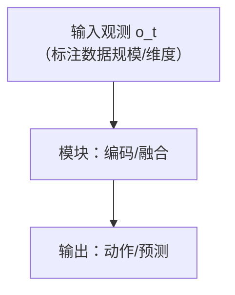
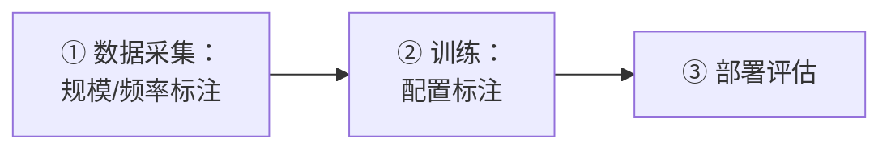
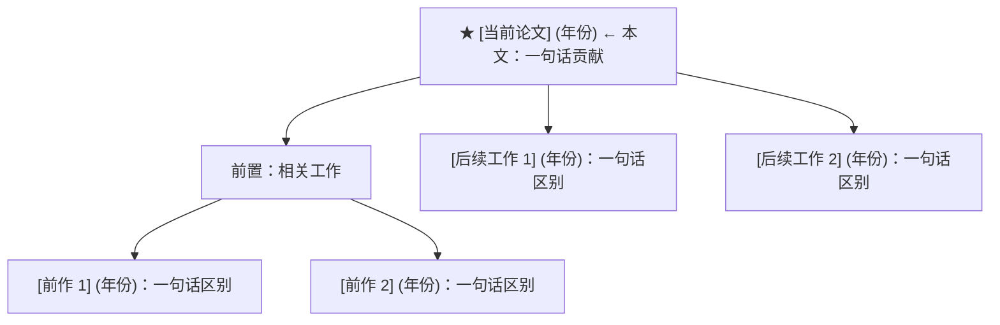

# [论文名称]

> **一句话总结：这篇论文做了什么核心贡献？（三个方向参考：1. 首次证明了什么？ 2. 提出了什么方法/架构，效果如何？ 3. 在什么基准上超越了哪些方法？）**

## 1. Paper Information

- **标题**: [英文标题]
- **作者**: [作者列表]
- **发表**: [会议/期刊] [年份]
- **链接**: [arXiv](链接) | [Code](仓库) | [Project Page](页面) | [Blog](博客)（可选）

---

## 2. Motivation

### 2.1 Background

<!-- 问题背景：当前主流方法是什么？有什么瓶颈？为什么现有方法不够好？比如 Model-Free 方法样本效率低、Model-Based 方法模型学不准等。 -->

### 2.2 Goal

<!-- 这篇论文希望回答什么问题？核心目标是什么？通常是一句话的研究问题。 -->

### 2.3 核心洞察

<!-- 作者洞察到了什么关键点？支撑这个目标的关键思想是什么？2–3 条 bullet 点出设计哲学。 -->

---

## 3. Core Ideas

<!-- 本文的核心贡献提炼为 3–4 个关键设计决策。用 ① ② ③ ④ 编号，每个 idea 一句话定位 + 一句解释为什么重要。 -->

### ① [第一个核心设计]

<!-- 如：RSSM：学习稳定的潜在动力学。结合 Deterministic State 与 Stochastic State，同时建模长期记忆和环境随机性。 -->

### ② [第二个核心设计]

<!-- 如：Latent Overshooting：训练时约束多步预测而非仅一步，使长期 Rollout 更稳定。 -->

### ③ [第三个核心设计]

<!-- 如：CEM Online Planning：用 Cross Entropy Method 在潜在空间搜索动作序列，实现 Model Predictive Control。 -->

### ④ [第四个核心设计]（可选）

---

## 4. Overall Framework

<!-- 系统整体架构图。核心约束：**所有流程图/结构图一律用 Mermaid（```mermaid）绘制，不要用 ASCII 手绘**（GitHub 等平台原生渲染，见范本 01-act / 02-smolvla）。

1. 数据流（Inference Path）至少一张：从观测到编码到模型到输出的完整链路，重点标出模块内部关键路径（如 RSSM 的确定性/随机性双路径）。
2. 训练与采集交替（如果适用）加第二张。
3. Mermaid 惯例：方向用 flowchart TD（纵向流程）或 LR（左右关系）；节点文本较长或含特殊符号（如 （）/→/×/+）时用双引号包裹 "文本"；换行用 <br/>；模块"大框"用 subgraph（id 用英文如 subgraph VLM["中文标签"]）；数据规模、维度可直接写进节点文本或写在图上下方。**防坑：节点文本内不要再嵌套 ASCII 双引号（会把字符串截断导致解析失败），需要强调时用「」或去掉引号。**
4. 算法伪代码（§7 / §8 的 Algorithm 框）不是图，保留模板的 ─ 分隔代码块格式，不要转 Mermaid。 -->

### 数据流（Inference Path）



### 训练与采集交替（如果适用）



---

## 5. Key Modules

<!-- 每个核心模块详细说明。 -->

### 5.1 [模块名称]

#### Motivation

<!-- 为什么需要这个模块？解决了什么问题？ -->

#### 核心思想

<!-- 输入 → 输出，架构，关键设计决策。 -->

> **一句话总结：** <!-- 这个模块最重要的贡献是什么？ -->

---

### 5.2 [模块名称]

<!-- 同上结构。 -->

---

## 6. Mathematical Formulation

### 符号说明

| 符号 | 含义 | 维度 |
|------|------|------|
| <!-- 符号 --> | <!-- 含义 --> | <!-- 维度 --> |

### [核心公式组 1]

<!-- 核心公式及直观理解。 -->

### [核心公式组 2]

<!-- 关键推导步骤。 -->

### [训练目标 / Loss 汇总]（如果适用）

<!-- 总体损失函数，各 Loss 项的含义。 -->

---

## 7. Training Pipeline

<!-- 训练循环的伪代码，使用以下格式：

```
─────────────────────────────────────────────────────────────
Algorithm: [算法名称]
─────────────────────────────────────────────────────────────
 1:  步骤
 2:  步骤
 ...
─────────────────────────────────────────────────────────────
```

让读者能直接参考实现。关键超参数可在注释中标注。 -->

---

## 8. Inference / Planning

<!-- 推理/部署阶段的核心逻辑。如果论文涉及规划、生成、测试等过程，在此详述。

可以包含：
- 算法伪代码
- 与替代方法的对比表（如适用）
- 关键设计要点 -->

---

## 9. Limitations

<!-- 论文自身承认的局限 + 读者能看到的隐含假设。4–6 条为宜，每条包含：
- 具体局限
- 为什么是局限
- （可选）后续方法如何改进 -->

这些局限直接引领了后续 [后续工作方向] 的发展。

---

## 10. Relationship

### 历史脉络

<!-- 用 Mermaid flowchart 绘制（结构图，不用 ASCII 树）：本文为根节点，向前接"前置工作"、向后接"后续工作"；节点文本含特殊符号时用双引号包裹，长文本用 <br/> 换行。 -->



### 承上：对前作的改进

<!-- 与前作（如有）的对比表，5–6 维度为宜。 -->

### 启下：对后续工作的影响

<!-- 4–5 条，每条结合具体工作说明。 -->

---

## 11. Personal Insights

### 这篇论文为什么重要？

<!-- 个人视角的评价。不只是"结果好"，而是它改变了什么认知？打开了什么方向？ -->

### [最有启发性的设计]

<!-- 比如：RSSM 的设计之美、某个损失的深层含义等。 -->

### 历史定位

<!-- 放到今天看，这篇论文的地位如何？什么被超越了，什么至今仍有启发？ -->

> 一句话评价：<!-- 精炼的全篇收尾。 -->

---

## 12. Discussion Points（讨论点 / 待验证）

<!-- 2–4 条值得拿出来与别人讨论、或留给后续验证的开放问题。来源可以是：
1. 论文说法与代码/复现不一致、或论文自身口径矛盾的地方（见 §7 核对表）；
2. 论文没解释、只给结论的消融（如"为什么这里不单调？"）；
3. 作者声称但证据不足、或你持怀疑态度的断言；
4. 你复现时遇到的、论文没覆盖的现象。

每条写清楚"问题是什么 + 为什么值得问 + 目前你的判断/证据"。这些条目是日后开 GitHub Discussion、请求纠错、或安排下一步精读的现成素材。 -->

- **讨论点 1**：<!-- 问题 + 背景 + 你的初步判断 -->
- **讨论点 2**：<!-- … -->
- **讨论点 3**：<!-- … -->
